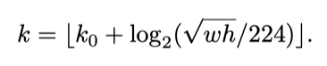

# FPN:Feature Pyramid Networks for Object Detection

## Abstract

特征金字塔是识别系统中用于检测不同比例物体的基本组件。但是最近的深度学习对象检测器避免了金字塔表示，部分原因是它们需要大量计算和内存。在本文中，我们利用深层卷积网络固有的多尺度金字塔层次结构来构建具有边际额外成本的特征金字塔。开发了具有横向连接的自上而下的体系结构，以构建各种规模的高级语义特征图。这种称为功能金字塔网络（FPN）的体系结构在多个应用程序中作为通用特征提取器显示出了显着的改进。通过在基本的Faster R-CNN系统中使用FPN，我们的方法在COCO检测基准上获得了最新的单模型结果，没有任何麻烦，超过了所有现有的单模型，包括2016年COCO挑战赛获奖者的模型。另外，我们的方法可以在GPU上以5 FPS的速度运行，因此是一种实用且准确的多尺度目标检测解决方案。

## Introduction

识别尺寸差异较大的对象是计算机视觉的一项基本挑战。建立在图像金字塔上的特征金字塔构成了标准解决方案的基础。这些金字塔在尺寸上是不变的，即对象的比例更改可以通过在金字塔中移动其层级来抵消。直观地，此属性使模型可以通过在位置和金字塔等级上扫描模型来检测各种尺度的对象。

特征化的图像金字塔在手工设计的特征时代被大量使用。特征化的图像金字塔在手工设计的特征时代被大量使用。 它们要求严格，以至于DPM之类的物体检测器都需要密集采样才能获得良好的结果。对于识别任务，工程特征已被深度卷积网络（ConvNets）计算的特征所取代。 除了能够表示更高层次的语义外，ConvNet还对尺度变化更为健壮，因此有助于从单个输入尺度上计算出的特征中进行识别。但是即使具有这种鲁棒性，仍然需要金字塔以获取最准确的结果。 ImageNet和COCO检测挑战中所有最近的热门条目都对特征化的图像金字塔进行了多尺度测试。使图像金字塔的每个级别特征化的主要优点是，它会产生多尺度特征表示，其中所有级别在语义上都很强大，包括高分辨率级别。

但是，为图像金字塔的每层进行特征表示具有明显的局限性。推理时间大大增加，使得这种方法在实际应用中不切实际。此外，就内存而言，在图像金字塔上端到端地训练深度网络是不可行的，因此，部分方法仅在测试时使用图像金字塔，这会导致训练/测试时推断的前后不一致。由于这些原因，Fast R-CNN 和Faster R-CNN选择在默认设置下不使用特征化的图像金字塔。

但是，图像金字塔并不是计算多尺度特征表示的唯一方法。深度卷积网络逐层计算特征层次结构，通过下采样层，特征层次结构可具有固有的多尺度金字塔形状。这种网络内特征层次结构可生成具有不同空间分辨率的特征图，但会引入由不同深度引起的较大语义差异。高分辨率特征图具有低级特征会损害其对象识别的表示能力。**（这句话不是很理解。可能是指下采样得到有损失的低级特征，然后用来表示高分辨率特征图效果不好？）**

SSD（Single Shot Detector）是使用ConvNet的金字塔特征层次结构的首次尝试之一，就好像它是特征化的图像金字塔一样。理想情况下，SSD样式的金字塔将重用前向遍历中计算出的不同层的多尺度特征图，从而节省成本。但是为了避免使用低级功能，SSD放弃了重用已经计算的层，而是从网络的高层开始构建金字塔（例如，VGG网络的conv4_3），然后添加几个新层。因此，它错过了重用特征层次结构的高分辨率特征图的机会。我们证明了这些对于检测小物体很重要。（深/高层的特征图由于经过池化等步骤，分辨率会降低。低分辨率的特征图能够给出的划定能力有限，高分辨率特征图的划定能力更好。这个可以参考FSSD）

本文的目的是自然地利用ConvNet的特征层次结构的金字塔形状，同时创建在各个尺度上具有强大语义的特征金字塔。为了实现此目标，我们依靠通过自上而下的路径和横向连接将低分辨率（语义上强的特征）与高分辨率（语义上弱的特征）相结合的体系结构。结果是一个特征金字塔，在所有级别上都具有丰富的语义，并且可以从单个尺度的输入图像进行快速构建。换句话说，我们展示了如何创建网络内特征金字塔，该金字塔可用于替换特征化的图像金字塔而不会牺牲表示能力，速度或内存。

在最近的研究中，采用自上而下和跳连的类似体系结构很流行。他们的目标是制作一个可以进行预测的精细分辨率的高级特征图。相反，我们的方法充分将结构用作特征金字塔，其中在每个级别上独立进行预测。我们的模型展示了一个特征化的图像金字塔，在别的工作中并未对此进行探讨。

我们在各种用于检测和分割的系统中评估我们的方法，称为特征金字塔网络（FPN）。我们仅基于FPN和基本的Faster R-CNN检测器，就可以在具有挑战性的COCO检测基准上得出最新的单模型结果，超过了所有现有的精心设计的结果以及竞赛获胜者的单一模型作品。在消融实验中，我们发现对于边界框预选，FPN显著提高了平均召回率（AR）8.0点； 对于物体检测，它在ResNets上的Faster R-CNN的强大单尺度基线上，将COCO样式的平均精度（AP）提高了2.3点，而PASCAL样式的AP则提高了3.8点。我们的方法也很容易扩展为掩膜预选，并通过高度依赖图像金字塔的最新方法提高了实例分割AR和速度。

此外，我们的金字塔结构可以进行所有尺度的端到端训练，并且在训练/测试时始终使用，这在使用图像金字塔的情况下是无法实现的。与所有现有的最新技术方法相比，FPN能够实现更高的准确性。此外该改进并不会增加单尺度基准模型的测试时间。我们相信这些进展将促进未来的研究和应用。

## Related Work

### Hand-engineered features and early neural networks

SIFT特征最初是在尺度空间极值处提取的，用于特征点匹配。HOG特征以及后来的SIFT特征在整个图像金字塔上进行了密集计算。这些HOG和SIFT金字塔已在许多工作中用于图像分类，物体检测，人体姿势估计等。快速计算特征图像金字塔也引起了人们极大的兴趣。Doll´ar等。通过首先计算稀疏采样（按尺度）的金字塔，然后对缺失的级别进行插值，演示了快速金字塔计算。在HOG和SIFT之前，早期使用ConvNets进行人脸检测的工作是在图像金字塔上计算浅层网络，以检测跨尺度的人脸。

### Deep ConvNet object detectors

随着现代深层ConvNets的发展，诸如OverFeat和R-CNN之类的对象检测器在准确性上有了显着的提高。OverFeat通过将ConvNet用作图像金字塔上的滑动窗口检测器，采用了类似于早期神经网络人脸检测器的策略。R-CNN采用了基于候选框（region proposal）的策略，其中在使用ConvNet进行分类之前，对每个候选框进行了尺度标准化。SPPnet证明，这种基于区域的检测器可以更有效地应用于以单个图像尺度提取的特征图。最近的更精确的检测方法，例如Fast R-CNN和Faster R-CNN，提倡使用从单个尺度计算出的特征，因为它在准确性和速度之间提供了很好的权衡。 但是，多尺度检测仍然表现得更好，特别是对于小物体。

### Methods using multiple layers

许多最新方法通过在ConvNet中使用不同的层来改进检测和分割。FCN对多个类别的每个类别的部分分数求和，以进行语义分割。Hypercolumns使用类似的方法进行对象实例分割。其他几种方法（HyperNet，ParseNet和ION）在计算预测之前会连接多层的特征，这相当于对转换后的特征求和。SSD和MS-CNN可以在不合并要素或得分的情况下预测要素层次结构中多层的对象。

最近有一些利用横向/跳连的方法，这些方法将跨分辨率和语义级别的低级特征图关联起来，包括用于分割的U-Net和SharpMask，用于面部检测的Recombinator网络以及用于关键点估计的Stacked Hourglass网络。Ghiasi等提出了FCN的拉普拉斯金字塔表示，以逐步完善分割。尽管这些方法采用具有金字塔形状的体系结构，但它们与特征化的图像金字塔不同，在特征化的图像金字塔中，各个级别的预测都是独立进行的，请参见图2。实际上，对于图2（顶部）中的金字塔体系结构，仍然需要图像金字塔识别多个尺度的物体。

## Feature Pyramid Networks’‘

我们的目标是利用ConvNet的金字塔特征层级结构，该层级结构具有从低到高的语义，并在整个过程中构建具有高层语义的特征金字塔。由此产生的特征金字塔网络是通用的，在本文中，我们将重点放在滑动窗口候选框（Region Proposal Network，简称RPN）和基于区域的检测器（Fast R-CNN）上。第6章中，我们还将FPNs推广应用到实例分割候选。

我们的方法将任意大小的单尺度图像作为输入，并以全卷积的方式在多个级别上输出比例大小的特征图。该过程与骨干卷积网络结构无关，在本文中，我们使用ResNets作为网络结构。我们的金字塔的构造涉及自下而上的路径，自上而下的路径和横向连接，如下所述。

### Bottom-up pathway

自下而上的途径是主干ConvNet的前馈计算，它计算包含多个缩放比例为2的特征图层次结构。通常会有许多层生成相同大小的输出图，我们说这些层处于同一网络阶段。对于特征金字塔，我们为每个阶段定义一个金字塔等级。我们选择每个阶段最后一层的输出作为特征图的参考集，我们将对其进行丰富以创建金字塔。这种选择是自然的，因为每个阶段的最深层都应具有最强的特征。

具体来说，对于ResNet，我们使用每个阶段的最后一个残差块输出的激活特征。对于conv2，conv3，conv4和conv5输出，我们将这些最后的残差块的输出表示为{C2，C3，C4，C5}，并注意它们相对于输入图像有{4、8、16、32}个像素的跨度。由于conv1占用大量内存，因此我们不将它包含在金字塔中。

### Top-down pathway and lateral connections

自上而下的路径通过从较高的金字塔层级对空间上较粗糙但语义上更强的特征图进行上采样来虚构高分辨率的特征。 然后通过自下而上的路径上的特征进行横向连接对其增强。每个横向连接融合了自下而上路径和自上而下路径的特征图。自下而上的特征图具有较低级别的语义，但是由于对其进行了较少次数的下采样，因此其激活位置更加准确。

图3显示了构建自上而下的特征图的构建块。使用较粗分辨率的特征图，我们将空间分辨率上采样2倍（为简单起见，使用最近的邻居上采样）。然后，通过逐元素相加将上采样后的图与相应的自下而上的图（经过1×1卷积层以减小通道尺寸）合并。重复此过程，直到生成最高分辨率图。要开始迭代，我们只需在C5上附加一个1×1卷积层即可生成最粗糙的分辨率图。 最后，我们在每个合并的特征图上附加一个3×3卷积以生成最终的特征图，这将减少上采样的混叠效应。这组最终的特征图称为{P2，P3，P4，P5}，分别对应于{C2，C3，C4，C5}，它们分别具有相同的空间大小。

由于金字塔的所有级别都像传统的特征化图像金字塔一样使用共享的分类器/回归器，因此我们在所有特征图中固定特征维（通道数，用d表示）。 我们在本文中将d设置为256，因此所有额外的卷积层都具有256通道输出。 在这些额外的层中没有非线性，我们凭经验发现这些非线性影响很小。

简单性是我们设计的核心，我们发现我们的模型对许多设计选择都具有鲁棒性。 我们已经试验了更复杂的模块（例如，使用多层残余模块作为连接），并观察到了略微更好的结果。 设计更好的连接模块不是本文的重点，因此我们选择上述简单的设计。

## Applications

我们的方法是用于在深层卷积网络中构建特征金字塔的通用解决方案。 接下来，我们在RPN中采用我们的方法来生成边界候选框，并在Fast R-CNN中采用我们的方法来进行对象检测。为了证明我们方法的简单性和有效性，我们在对原始系统进行了最小化修改后使其适应了我们的特征金字塔。

### Feature Pyramid Networks for RPN

RPN是与滑动窗口无关的对象检测器。在最初的RPN设计中，在单个尺度卷积特征图的顶部，在密集的3×3滑动窗口上评估一个小型子网，执行对象/非对象二分类和边界框回归。这是通过3×3卷积层，然后是两个同级1×1卷积进行分类和回归来实现的，我们将其称为网络头。对象/非对象标准和边界框回归目标是针对称为“锚点”的一组参考框定义的。锚具有多个预定义的比例和长宽比，以覆盖不同形状的对象。

我们通过使用FPN替换单尺度特征图来适应RPN。我们将相同设计的头部（3×3卷积和两个同级1×1卷积）附加到功能金字塔上的每个层级。由于头部在所有金字塔层次上的所有位置上密集滑动，因此不必在特定层次上使用多尺度锚。相反，我们将单个比例的锚分配给每个级别。形式上，我们定义锚点在{P2，P3，P4，P5，P6}上分别具有{$32^2$，$64^2$，$128^2$，$256^2$，$512^2$}个像素的区域.如[29]所示，我们还在每个级别使用多个宽高比{1：2、1：1、2：1}的锚点。 因此，金字塔上总共有15个锚点。

我们根据基于Intersection-over-Union（IoU）与真实边界框的比值为锚点分配训练标签，如[29]中所述。正式地，如果锚点对于给定的真实包围盒具有最高的IoU，或者对于任何真实实物盒具有超过0.7的IoU，则为其分配正标签；而对于所有真实包围盒，如果其IoU低于0.3，则将为其分配负标签。注意，真实包围盒的尺寸没有明确地用于确定它们的金字塔等级； 取而代之的是，真实包围盒与已确定金字塔等级的锚点关联。因此，除了[29]中的规则外，我们没有引入其他规则。

我们注意到，头部的参数在所有特征金字塔级别之间共享。我们还评估了不共享参数的替代方案，并观察到了相似的准确性。共享参数的良好性能表明我们金字塔的所有级别共享相似的语义级别。该优点类似于使用特征化图像金字塔的优点，其中可以将通用的头部分类器应用于以任何图像尺寸计算的特征。

通过上述修改，RPN可以用我们的FPN进行自然训练和测试，方法与[29]相同。 我们在实验中详细说明了实现细节。

### Feature Pyramid Networks for Fast R-CNN

Fast R-CNN是基于区域的对象检测器，其中，兴趣区域（RoI）池用于提取特征。 快速R-CNN通常在单比例尺特征图上执行。 要将其与我们的FPN一起使用，我们需要将不同比例的RoI分配给金字塔级别。

我们将特征金字塔视为是由图像金字塔产生的。 因此，当它们在图像金字塔上运行时，我们可以调整基于区域的检测器的分配策略。 正式地，我们通过以下方式将宽度w和高度h（在输入图像上的RoI）分配给特征金字塔的$P_k$层：

这里224是规范的ImageNet预训练大小，而$k_0$是映射到其中w×h = $224^2$的RoI的目标层级。类似于使用$C_4$作为单尺度特征图的基于ResNet的Faster R-CNN系统，我们将$k_0$设置为4。 （1）表示，如果ROI的尺度变小（例如224的1/2），则应将其映射为更精细的分辨率水平（例如k = 3）。

我们将预测头（在Fast R-CNN中，这些头是特定于类的分类器和边界框回归器）附加到所有级别的RoI。在[16]中，ResNet的conv5层（一个9层的深度子网）被用作conv4特征之上的头，但是我们的方法已经利用conv5来构建特征金字塔。因此，与[16]不同，我们仅采用RoI池来提取7×7特征，并在最终分类和边界框回归层之前附加两个隐藏的1,024-d全连接（fc）层（每个层紧随ReLU）。这些层是随机初始化的，因为ResNets中没有可用的预训练fc层。 请注意，与标准conv5头相比，我们的2-fc MLP头更轻且速度更快。

基于这些修改，我们可以在特征金字塔的顶部训练和测试Fast RCNN。 实现细节在实验部分给出。

## Experiments on Object Detection

