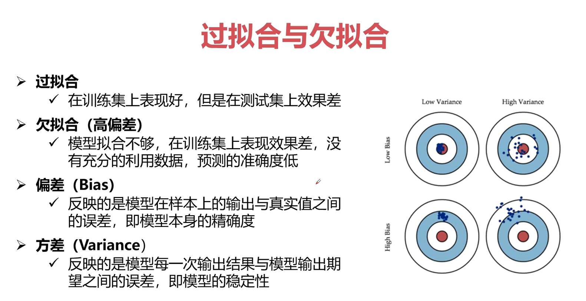
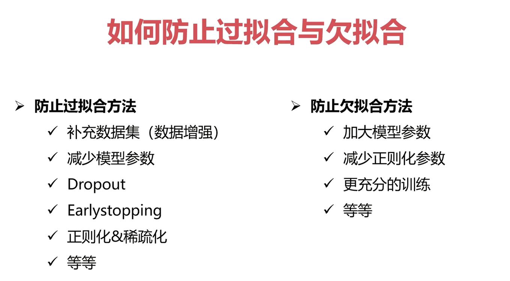
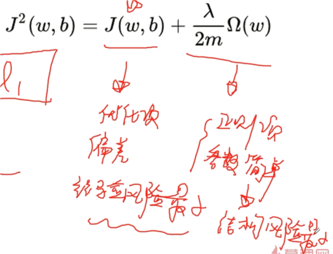
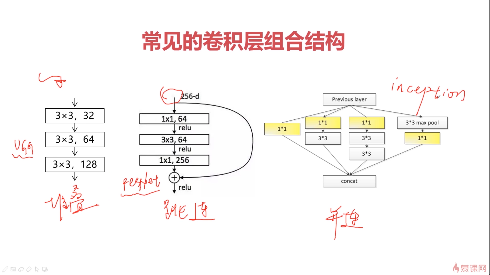
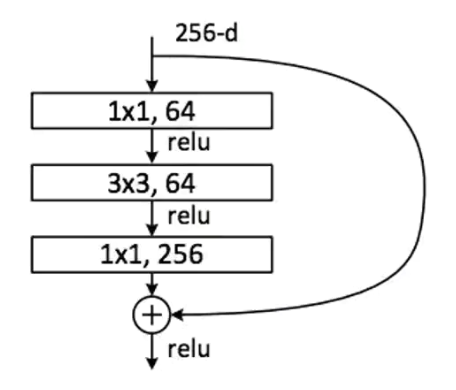
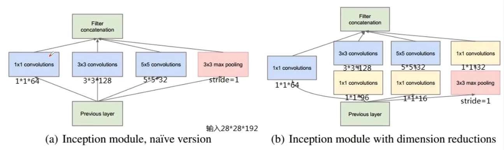

# Pytorch

## pytorch中的广播机制

广播机制：张量参数可以自动扩展为相同大小

广播机制需要满足两个条件：

- 每个张量至少有一个维度
- 满足右对齐

右对齐实例：troch.rand(2,1,1)+torch.rand(3) 该例满足右对齐（除了加法，减，乘，除也满足）

右对齐判别方式，维度小的往左侧补1知道同维，然后依次判断，**所有的数（各维度）相等或者其中一个为1**，如果所有数均满足，则满足右对齐。结果为2\*1\*3（维度相等取相等，维度含1取另一个）

## Tensor的比较运算

torch.eq(input, other, out=None) #按成员进行等式操作，相同返回True（返回的是同尺寸向量，里面元素是True和False）

torch.equal(tensor1, tensor2) #如果tensor1和tensor2有**相同的size和elements**，则为true（单个值，True或者False）

## Tensor张量裁剪

a.clamp(2, 5) #a为tensor张量，2和5是范围上下界，小于2的会被修改为2，大于5的会被修改为5，其余保留原本的数值。

## 有监督学习、无监督学习、半监督学习

- 样本X，标签Y

所谓有监督学习就是指数据集中既有X又有Y（典型的例子有LDA线性判别分析、SVM）；所谓无监督学习就是指数据集中只有X没有Y（典型的例子为聚类）

所谓**半监督学习**有几种情况：

1. 弱标签：标签不准确、标签可能错误
2. 伪标签：比如标签是通过聚类获取到的
3. 一部分有标签，一部分没标签

## FC层（全连接层）

层中包含的皆为线性运算。

## 损失函数

对于回归问题，$l_1$、$l_2$损失函数；对于分类问题，softmax、交叉熵计算损失。

## 过拟合与欠拟合

### 概念

 

这部分可以结合西瓜书中所提到的偏差-方差分析来思考。

模型的不稳定也代表了模型可能存在过拟合或欠拟合。

高偏差一般是欠拟合（模型选择可能存在问题）。

### 应对方法：



## 正则化问题



## 交叉熵损失函数——分类问题可采用的损失函数

[博客](https://blog.csdn.net/b1055077005/article/details/100152102)

**信息量的大小与信息发生的概率成反比**。概率越大，信息量越小。概率越小，信息量越大。

设某一事件发生的概率为P(x)，其信息量表示为：
 *I*(*x*)=−log(*P*(*x*))
 其中*I*(*x*)表示信息量，这里log表示以e为底的自然对数。

**KL散度 = 交叉熵 - 信息熵**

- 交叉熵在分类问题中常常与softmax是标配，**softmax将输出的结果进行处理**，使其多个分类的预测值和为1，**再通过交叉熵来计算损失**。

## 常见的卷积层组合结构



## 神经网络中常见的层（激活层、全连接层、BatchNorm层、Dropout层、损失层）

### 激活层

激活函数：为了增加网络的非线性，进而提升网络的表达能力

- ReLU函数（最常用）、Leakly ReLU函数、ELU函数

### BatchNorm层

通过一定的规范化手段，把每层神经网络任意神经元这个输入值的分布强行拉回到均值为0方差为1的标准正态分布。

BatchNorm是归一化的一种手段，它会减小图像之间的绝对差异，突出相对差异，加快训练速度

不适用的问题：image-to-image以及对噪声敏感的任务

常用的结构顺序：卷积层 ---> ReLU层 ---> BatchNorm层

### 全连接层

连接所有的特征，将输出值送给分类器（如softmax分类器）

- 对前层的特征进行一个加权和，（卷积层是将数据输入映射到隐层特征空间）将特征空间通过线性变换映射到样本标记空间（也就是label）
- 可以通过1*1卷积+global average pooling代替
- 可以通过全连接层参数冗余
- 全连接层参数和尺寸相关

FC层（全连接层）：

1. 对尺寸敏感
2. 参数多（因此通过会配合dropout）

### Dropout 层

在不同的训练过程中随机扔掉一部分神经元（效果：训练过程中减少参数，防止过拟合；让模型简单。实现结构最小化）

测试过程中不适用随机失活，所有的神经元都激活

dropout层是为了防止或减轻过拟合而使用的函数，它一般用在全连接层

### 损失层

损失层：设置一个损失函数用来比较网络的输出和目标值，通过最小化损失来驱动网络的训练

网络的损失通过前向操作计算，网络参数相对于损失函数的梯度则通过反向操作计算

分类问题损失：（需要处理离散值）主要作用于分类和分割问题上

- nn.BCELoss；nn.CrossEntropyLoss

回归问题损失：（主要处理连续值）主要作用于检测和回归分析中

- nn.L1Loss；nn.MESLoss；nn.SmoothL1Loss

## 经典卷积神经网络结构

- 简单神经网络
  - LeNet
  - AlexNet
  - VGGNet
- 复杂神经网络
  - ResNet
  - InceptionNetV1-V4
  - DenseNet
- 轻量级神经网络（压缩计算量/参数，利于模型落地）
  - MobileNetV1-V3
  - ShuffleNet
  - squeezeNet

### 串联结构的典型代表

- LeNet、AlexNet、ZFNet
- VGGNet（提取特征）：为了研究网络深度对模型准确度的影响，并采用==**小卷积**==堆叠的方式，来搭建整个网络结构。

### 跳连结构的典型代表

- ResNet
  - 引入跳连的结构来防止梯度消失的问题，进而可以进一步加大网络深度
  - 扩展结构：ResNeXt、DenseNet、WideResNet、ResNet In ResNet、Inception-ResNet



### 并行结构的典型代表

- InceptionV1-V4（GoogleNet）
  - 在设计网络结构时，不仅强调网络的深度，也会考虑网络的宽度，并将这种结构定义为Inception结构（一种网中网（Network In Network）的结构，即原来的结点也是一个网络）
  - 所谓网络的宽度是指在同一个特征图的维度上channel的数量



类似于把可能性均列举出来，然后通过计算比较出最好的结构。在工程实现中，这种结构并不方便进行加速，所以在工程实现上使用的较少。

### 轻量型结构的典型代表

- MobileNetV1
  - 使用Depth-wise Separable Convolution（深度可分离卷积）的卷积方式代替传统卷积方式，以达到减少网络权值参数的目的
  - 深度可分离卷积：通过将一个标准的卷积进行分组卷积（可得到空间特征/信息，失去通道之间的信息）和点卷积（学习通道之间的关系）两种操作来进行替换
  - 标准卷积计算量与（分组卷积+点卷积）计算量的比较，参见视频《5-9 轻量级网络结构》

- MobileNetV2（结合ResNet的思想）、MobileNetV3（使用网络搜索的思想，找到更加轻量级的模型且效果更好）

### 多分支结构的典型代表

整个网络模型不止包含一个主干

主要用来解决相似性问题（人脸识别：faceNet）、多任务网络（检测任务：同时完成分类和物体坐标的定位）

- SiameseNet：2分支
- TripletNet（目前性能较优）：3分支
- QuadrupletNet：4分支

### Attention结构的典型代表

Attention机制

- 对于全局信息，注意力机制会重点关注一些特殊的目标区域，也就是所谓的注意力焦点，进而利用有限的注意力资源对信息进行筛选，提高信息处理的准确性和效率
- one-hot分布或者soft的软分布
- Soft-Attention（0~1连续值，关注的权重）或者Hard-Attention（0或者1表示是否关注）
- 可以作用在特征图上，尺度空间上，channel尺度上，不同时刻历史特征上等

## 学习率

- 学习率作为监督学习以及深度学习中重要的超参，其决定着目标函数能否收敛到局部最小值以及何时收敛到最小值
- 合适的学习率能够使目标函数在合适的时间内收敛到局部最小值
- torch.optim.lr_scheduler
  - ExponentialLR（学习率指数衰减）
  - ReduceLROnPlateau
  - CyclicLR

## 优化器

- 梯度下降算法：GD、BGD（全部样本，速度慢）、SGD（随机梯度下降，每次随机选择一个样本，容易手受到噪声干扰，loss容易震荡）、MBGD（mini-batch思想，每次考虑n个样本，即batchsize，降低随机性和噪声的干扰，比BGD收敛更快，比SGD收敛更稳定）
  - 引入了随机性和噪声
- mini batch思想（仍然依赖于batch内的噪声和随机性）改进：Momentum、NAG等：考虑前几个batch的梯度，对当前梯度进行缓冲
  - 加入动量原则，具有加速梯度下降的作用
- AdaGrad、RMSProp、==**Adam**==、AdaDelta
  - 自适应学习率
- torch.optim.Adam

## 卷积神经网添加正则化

正则化：结构最小化；loss：风险最小化。

- L0正则：结构越简单越好，即0越多越好（代表某部分内容不激活，也就是结构简单了），但是没有数学式子能够直接对其进行表示，所以有了L1

- L1正则：参数绝对值的和；对L0的逼近（0越多越好，相似于参数绝对值和越小越好），稀疏化（不可导不方便计算，进而有了L2）Pytorch中使用需要自己定义
- L2正则：参数的平方和（Pytorch自带，weight_decay）
- optimizer = torch.optim.SGD(model.parameters(), lr=0.01, weight_decay=0.001)

## 截取已有网络结构中的部分层

思路：转化为list之后截取

```python
truncated_model = nn.Sequential(*list(model.children())[:8])
```

[参考博客](https://www.jianshu.com/p/d2a066e05078)

## CrossEntropyLoss交叉熵

使用交叉熵损失函数时，loss_func(out, y)。其中out输出的结果是一个二维的列表，内列表中的维度数与分类的类别数相同；y是一个一维的列表，存放着对应out中每个样本的类别号。