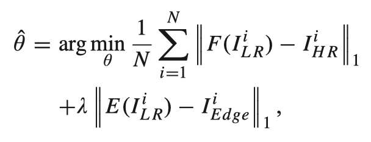
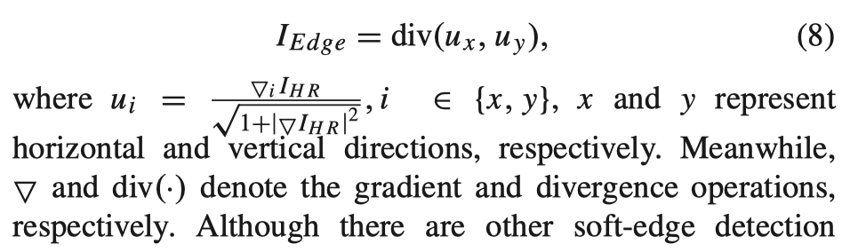
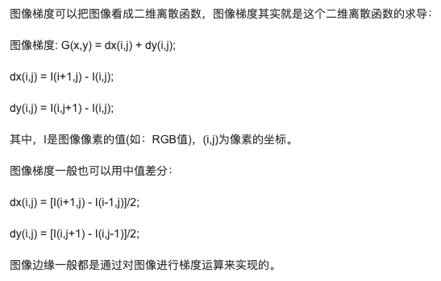
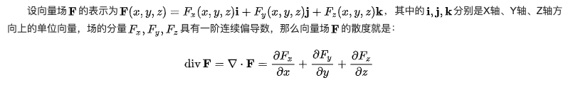
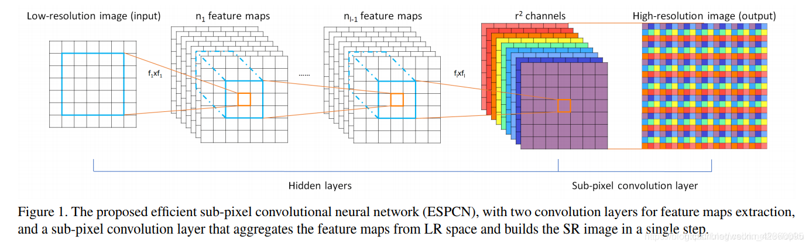

# Soft-Edge Assisted Network for Single Image Super-Resolution

标题：软边缘辅助网络实现单图像超分辨率

## Abstract

单图像超分辨率（SISR）的任务是一个不适定反问题，因为从低分辨率图像重建高频细节非常具有挑战性。以前大多数基于CNN的超分辨率（SR）方法都倾向于通过一些复杂的卷积神经网络直接学习从低分辨率图像到高分辨率图像的映射。但是，盲目增加网络深度的方法不是最佳选择，因为这种方法的性能改进很小，但是计算成本却很高。一种更有效的方法是将图像先验知识整合到模型中以协助图像重建。实际上，软边缘作为重要的图像特征已被广泛应用于许多计算机视觉任务中。在本文中，我们提出了一种软边缘辅助网络（SeaNet），借助图像软边缘来重建高质量的SR图像。本文提出的SeaNet由三个子网组成：一个粗糙的图像重建网络（RIRN），一个软边缘重建网络（Edge-Net）和一个图像改善网络（IRN）。 完整的重建过程包括两个阶段。 在第一阶段，粗略的SR特征图和SR软边缘分别由RIRN和Edge-Net重建。  在第二阶段中，将先前阶段的输出进行融合，然后输入IRN中以进行高质量SR图像重建。 大量的实验表明，在图像软边的帮助下，我们的SeaNet可以快速收敛并获得出色的性能。 该代码位于https://gitlab.com/junchenglee/seanet-pytorch。

## Introduction

单图像超分辨率（SISR）是计算机视觉领域中的一个非常热门的话题，其目的是从单个低分辨率（LR）图像重建超分辨率（SR）图像（图1）。 它已广泛用于计算机视觉任务，例如医学图像增强，视频超分辨率和面部错觉。 同时，重建图像的质量显着影响上层任务的准确性，例如图像分类，目标检测和图像分割。 尽管SISR的应用范围很广，但由于信息丢失，它仍然被认为是高度的不适定问题。

最近，卷积神经网络（CNN）在许多计算机视觉任务中都取得了显著成功，并极大地促进了SISR的发展。为了解决SISR问题，已经研究了很多基于CNN的模型。其中，Dong等，提出了超分辨率卷积神经网络（SRCNN），这是将CNN应用于SISR问题的第一个成功模型，并取得了显着改善。后来，Kim等，扩展了网络的深度，并通过残差学习解决了[VDSR(Very Deep Super Resolution)](https://blog.csdn.net/weixin_40493501/article/details/93379317)。前述模型均使用预处理的LR图像作为输入，并通过[Bicubic插值（双三次插值算法）](https://blog.csdn.net/nandina179/article/details/85330552)将其放大到HR尺寸。但是，有人认为，使用预处理的LR图像作为输入会增加计算复杂性并产生可见的伪像。因此，ESPCN引入了一个有效的亚像素卷积层，该层可以学习一系列放大滤波器，以将最终的LR特征图直接放大为SR图像。 FSRCNN在模型的末尾采用了反卷积层，以直接学习原始LR和SR图像之间的映射。

之后，基于CNN的SR模型如雨后春笋般出现，并不断刷新最佳结果。例如，Kim等，研究了一种用于SISR的深度递归卷积网络，该网络引入了递归监督学习以减少模型参数；Lai等提出了一个拉普拉斯金字塔网络来逐步重建HR图像的子带残差。 Li等考虑了一种多尺度残差网络，以提取丰富的图像特征以进行高质量的SR图像重建；He等利用残差块建立了一个极其广泛和深厚的EDSR网络，从而获得了最新的结果。

但是，上述SR模型中仍然存在两个潜在问题：（1）由于所有这些方法都倾向于使用更深的网络，因此对这些网络的训练变得更加困难，并且需要更多的训练数据，时间和内存。 （2）大多数基于CNN的SR模型都是通过最小化某些损失函数来直接学习LR和HR图像之间的映射。但是，由于缺乏自然图像的先验知识，他们很难重建现实的高频细节。

各种先前的工作已经指出，图像的先验知识的应用可以有效地辅助图像重建。因此，已经提出了许多用于图像重建的图像先验知识，其中总变化量（TV）先验，稀疏先验和边缘先验是非常受欢迎。受这些研究的启发，最近的工作试图将总变化量或稀疏先验引入到用于SR图像重建的深度神经网络中。但是，总变化量先验会平滑恢复图像中的纹理细节，而稀疏先验通常很难建模，因为它需要其他领域知识。之后，Yang等将边缘先验与递归网络相集成，并提出了用于SISR的边缘导引递归残差网络。尽管这些方法已经将图像先验引入到深层网络中，但是如何准确地提取图像先验以及如何有效地使用图像先验来协助图像重建仍然是一个挑战。

众所周知，图像可以分为两个部分：低频部分和高频部分。低频分量是指图像强度变化缓慢的区域，即大色块所在的区域。高频成分是指图像的强度急剧变化的区域，即图像的边缘。受这些事实的驱使，我们旨在探索一个统一的框架，该框架可以自动提取和整合软边缘先验的图像超分辨率。为此，我们建立了用于图像超分辨率的软边缘辅助网络（SeaNet），该网络由粗糙的图像重建网络（RIRN），软边缘重建网络（Edge-Net）和图像改善网络组成（IRN）。具体来说，重建过程分为两个阶段。在阶段一中，我们分别通过RIRN和Edge-Net重建了粗糙的图像特征图和图像软边缘。两个子网均以LR图像作为输入，并获得高维空间中的对应映射。在第二阶段，我们首先通过[瓶颈层](https://zhuanlan.zhihu.com/p/98692254)融合重建的图像特征图和图像软边缘。然后，我们将融合后的特征图发送到IRN，以进行最终的SR图像重建。所有这些子网构成了完整的软边缘辅助网络（SeaNet）。大量的实验和消融分析表明，在先验软边缘的帮助下，我们的SeaNet可以快速收敛并重建具有高频细节的真实SR图像。主要贡献如下：

1.	我们提出了一个软边缘重建网络（Edge-Net），这是用于直接从LR图像重建图像软边缘的第一个CNN模型。 EdgeNet可以独立用于图像软边缘重建，也可以作为子网嵌入到任何SR模型中，从而为高质量SR图像重建提供图像软边缘。
2.	我们提出了一种有效且准确的软边缘辅助网络（SeaNet），这是一个经过精心设计的网络，引入了Edge-Net来提供图像软边缘先验知识。

本文的其余部分安排如下。 在第二节中对相关工作进行了回顾。 本文提出的SeaNet的详细说明在第三部分中给出。 实验结果和消融分析分别在第四部分和第五部分中给出。 最后，我们在第六节中得出结论。

## Related works

### Single Image Super-Resolution

在过去的几十年中，图像超分辨率，尤其是单图像超分辨率（SISR）极为流行。 可以在[30]和[31]中找到详尽的报告。 在本文中，我们将重点放在SISR任务上，所有比较方法均基于SISR。

SISR的发展可以简单地分为两个阶段：（1）较早的方法是使用基于采样理论的插值方法，例如线性或双三次插值方法，这些方法既快速又灵活。但是，这些方法无法重建高频纹理细节，因此无法重建真实的SR图像。 （2）后来，基于学习技术的更强大的方法被应用来建立LR和HR图像之间的复杂映射。基于稀疏性的SR方法假定可以从数据库学习的字典中稀疏地表示任何自然图像。邻域嵌入方法通过在低维流形中找到相似的块并将其对应的HR块组合以进行SR图像重建来对LR图像块进行上采样。除上述方法外，还提出了其他基于学习的方法来学习LR和HR图像之间的映射，包括卷积神经网络（CNN）和随机森林。其中，基于CNN的方法已表现出出色的性能，并成为当前的主流手段。大多数基于CNN的方法都倾向于使用更宽更深的网络来重建SR图像。然而，这些模型通常无法获得高频细节，而无法重构高频细节并导致大量资源开销。为了解决这个问题，我们旨在探索一种有效而准确的SR模型，该模型可以引入图像先验信息进行高频特征学习。

### Edge-Assisted Image Reconstruction

在过去的几十年中，基于图像先验的图像重建有了巨大的发展。在所有图像先验中，图像边缘先验是最有效的先验之一，因为图像边缘是重要的图像特征。大量的边缘辅助或边缘引导图像处理方法已经验证了图像边缘先验的可行性和必要性。但是，这些方法的实现很复杂，并且存在一定的局限性。例如，Yang等将图像边缘引入到CNN模型中，并提出了边缘导引残差（DEGREE）网络。作为一项开创性的工作，此方法仍然存在一些缺点，导致性能欠佳，例如（a）DEGREE使用Bicubic预处理（双三次插值预处理）的LR图像作为输入。这会带来额外的噪音并产生可见的伪影。 （b）DEGREE在预处理的LR图像上应用现成的边缘检测器（例如Sobel检测器）以获取图像边缘。这可能会引入其他噪声并导致图像边缘模糊（图2（b））； （c）DEGREE将学习到的图像边缘特征直接添加到LR图像以获得最终的SR图像；从本质上讲，这是一种残差学习，而加法无法最大程度地利用图像边缘先验。 （d）DEGREE是一个循环网络。循环机制可以减少模型参数，但不能减少执行时间。另外，训练循环网络需要更多的训练技巧。为了解决上述问题并充分利用图像边缘，我们旨在探索一种有效的边缘重建网络（图2（c）），以从LR图像直接重建清晰的图像边缘，并建立一个两段框架以充分利用图像边缘先验来重建SR图像。

### Image Soft-Edge

图像亮度急剧变化的点通常组织成一组称为图像边缘的曲线段。 已经提出了多种方法来提取图像边缘，包括Sobel，Prewitt，Roberts和Canny。 但是，我们发现这些方法有一定的局限性，很难应用于任意图像。 同时，这些现成的边缘检测器使用二值化测量将边缘的所有值转换为0和1，这会导致大量图像特征的丢失和虚假边缘的出现。 为避免这些问题，我们建议使用图像软边缘而不是图像边缘。 通过消除二值化策略来获取软边缘，以保留准确的图像边缘信息。 详细的获取方法将在第III-B节中介绍。

## Soft-edge assisted network

如图3所示，我们的软边缘辅助网络（SeaNet）包括一个粗糙的图像重建网络（RIRN），一个软边缘重建网络（Edge-Net）和一个图像改善网络（IRN）。 具体来说，SeaNet可以分为两个阶段。 在阶段一中，我们使用RIRN从LR图像中提取低频特征并重建粗糙的SR特征图。  另外，我们建立了一个有效的Edge-Net，可以直接从LR图像重建清晰的超分辨率软边缘。 在阶段二中，阶段一的输出由瓶颈层连接和融合。 然后将融合的图像特征发送到IRN，以进行最终的SR图像重建。 我们将$I_{LR}$和$I_{SR}$分别定义为SeaNet的输入和输出。 此外，$f_{rough}$和$f_{edge}$分别代表RIRN和EdgeNet的输出。 因此，阶段I中的粗糙SR图像特征图提取和图像软边缘重建可以表示为：

$f_{rough} = F_{RIRN}(I_{LR})$,

$f_{edge} = F_{Edge−Net}(I_{LR})$

$F_{RIRN}$代表RIRN网络，$F_{Edge-Net}$代表Edge-Net网络。$f_{rough}$代表了低频图像特征（粗糙的SR特征图），$f_{edge}$代表了高频图像特征（图像软边缘）。$f_{rough}$和$f_{edge}$通过一个融合层进行合并，

$f_{fusion}=F_{fusion}([f_{rough}, f_{edge}])$,

[]是连接操作，$F_{fusion}(·)$代表了融合层。融合层本质上是一个瓶颈层，它实现了特征融合并增加了特征间的非线性关系。完成以上操作之后，合并的图像特征被送入IRN中进行第二阶段的高质量SR图像重建。

$I_{SR}=F_{IRN}(f_{fusion})$,

$F_{IRN}(·)$表示IRN，$I_{SR}$是最终的SR图像。

与以前的工作直接学习LR和HR图像之间的映射的工作不同，我们提出了一种边缘辅助损失函数。 边缘辅助损失函数包括内容损失和边缘损失。

$\lambda$是超参数，$\theta$代表了SeaNet的参数集，$F(·)$和$E(·)$分别代表了SeaNet和Edge-Net。

值得注意的是，Edge-Net充当了SeaNet的子网，并以端到端的方式与整个模型一起进行了训练。

### Rough Image Reconstruction Network(RIRN)

在阶段I中，我们使用RIRN进行SR图像特征图的粗略重构。 众所周知，借助CNN强大的表示能力，可以轻松检测图像的低频特征。 因此，一个浅层的CNN模型足以完成此任务。 与以前的工作类似，我们首先使用3×3卷积层将图像从RGB通道转换为更高的维度。 然后，应用五个卷积层从LR图像中提取低频图像特征，每一层可表示为：

$f_m=max(0,W_m*f_{m-1}+b_m)$

其中$f_{m-1}$是前一层的输出也被当作这一层的输入。$f_m$，$W_m$，$b_m$分别代表当前层的输出，权重和偏置。最终，被提取出的低频特征通过上采样模块被升级到了HR维度。

$f_{rough}=F_{UP}(f_5)$

其中$F_{UP}$代表上采样模块，包含两个卷积层和一个子像素卷积层。输出$f_{rough}$代表了重建的粗糙SR图像特征。它包含三个特征图，本质上是SR空间中低频特征的表示。

### Soft-Edge Reconstruction Network (Edge-Net)

图像边缘先验是最广泛使用和最容易收集的先验知识之一。 如图5所示，将从LR图像提取的图像软边缘直接上采样到HR空间中，或从上采样的LR图像中提取图像软边缘会导致边缘模糊并引入额外的噪声。 为了解决这个问题，我们设计了一个软边缘重建网络（Edge-Net），可以直接从LR图像重建超分辨率图像的软边缘。

在第II-C节中，我们介绍了图像软边缘和图像边缘之间的区别。 图像软边缘可以保留更准确的图像边缘信息，因此我们可以使用以下曲率公式从$I_{HR}$获得相应的软边缘$I_{Edge}$，因为它可以准确描述梯度域中的变化：

图像梯度，补充公式8：

divergence operation，散度：

尽管还有其他软边缘检测方法可用于构造训练数据集的标签，但大量实验表明，通过我们提出的曲率公式检测到的图像软边缘在这项工作中已经足够好。

对于Edge-Net，我们使用改进的多尺度残差网络（MSRN）作为其结构。 MSRN是一种高效的网络，可以自适应地检测不同比例的图像特征。 该特性对于图像软边缘提取是有益的。 但是，我们发现原始MSRN太复杂了。 为了使MSRN适应软边缘重建任务，我们进行了以下修改：（1） 减少M，即多尺度残差块的数量。 （2）学习$I_{LR}$和$I_{Edge}$之间的映射，而不是$I_{LR}$和$I_{HR}$之间的映射。

Edge-Net可用作任何SR模型的一部分以提供图像软边缘，或独立工作以直接从LR图像重建超分辨率图像软边缘。 其最终目标是学习一种重构功能，该功能可以从相应的LR输入重构SR软边缘。 因此，我们将边缘损失定义为：

$L_{edge}=||E(I_{LR}-I_{Edge})||_1$

其中$E(·)$代表Edge-Net，$E(I_{LR})$表示重建出的软边缘，$I_{Edge}$是从对应HR图像中检测出的软边缘。值得注意的是，由于我们还在Edge-Net中引入了上采样模块，因此重构图像的软边缘与HR图像具有相同的尺寸。

### Image Refinement Network (IRN)

在第一阶段中，我们分别使用RIRN和Edge-Net来重构SR图像的粗略特征和图像的软边缘。 重建的粗糙SR图像特征包含大量低频特征，重建的软边缘包含丰富的高频细节。 但是，这两个子网是独立的，并且这些模块的输出不能相互交互。 一种常见且简单的方法是直接将这两个部分的输出相加以获得最终的SR图像。 尽管此方法可行，但我们发现其结果不是最佳的。 为了充分利用图像特征并实现软边引导，我们为最终SR图像重建建立了图像改善网络（IRN）。 具体来说，我们应用融合层融合低频和高频特征，然后将融合的特征图发送到IRN以重建SR图像。

IRN是一个精心设计的图像改善网络，其中包含两个卷积层和N个残差块。 残差块广泛用于各种计算机视觉任务中，残差学习的原理可以解释如下：

注1：认为$H(x)$是要由一些堆叠的卷积层拟合的基础映射，x表示此块的输入。 如果多个非线性层可以渐近逼近复杂函数，我们还可以假设它们可以渐近逼近残余函数，即$H(x)-x$。 因此，我们没有期望堆叠的层近似于$H(x)$，而是让这些层近似于残差函数$F(x)= H(x)-x$。 然后可以将原始函数定义为$H(x)= F(x)+x$。

我们的残差块包含两个卷积层和一个ReLU函数，ReLU函数仅应用于第一层。 与原始残差块不同，我们删除了所有批量归一化（batch normalization）层以减少内存使用量。 因此，每个残差块的输出$f_{rb}^n$可以定义为：

$f_{rb}^n=(W_2*R(W_1*f_{rb}^{n-1}+b_1)+b_2)+f_{rb}^{n-1}$，

其中$W_1$和$W_2$代表了第一层和第二层卷积层的权重，$b_1$和$b_2$代表了对应层的偏置，$R$代表了ReLU函数，$f_{rb}^{n-1}$是之前层的输出，也是当前层的输入。

此外，除了将残差块用于局部残差学习外，我们还将长跳连接应用于全局残差学习。 长跳连接可以解决梯度消失的问题，同时增加信息流并提高模型性能。 全局残差学习可以定义为：

$f_{out}=f_{rb}^N+f_{input}$

其中$f_{input}$表示第一个残差块的输入，$f_{rb}^N$表示最后一个残差块的输出。

在训练过程中，我们使用L1损失作为内容损失，以最大程度地减少SR和HR图像之间的差异：

$L_{content}=||I_{SR}-I_{HR}||_1$

综上所述，在图像软边缘的帮助下，SeaNet可以有效地重建具有锐利边缘和丰富纹理细节的高质量SR图像。 然后RIRN，EdgeNet和IRN构成完整的软边辅助网络（SeaNet）。 内容损失$L_{SR}$和边缘损失$L_{Edge}$构成完整的边缘辅助损失$L_{total}$，

$L_{total}=L_{content}+\lambda L_{edge}$

其中$\lambda$是超参数，用来控制边缘损失组成。这里特别强调的是，尽管SeaNet由三个子网组成，但它也可以实现端到端培训。

总体而言，我们根据图像包含低频和高频特征的事实设计了一个名为SeaNet的模型。 具体来说，SeaNet是一个经过精心设计的模型，其中包含基于特定学习目的的三个子网。 此外，这些子网定义明确，可以协同工作，从而大大提高了所建议网络的可解释性。

## Experiments

### Datasets

DIV2K 是用于图像恢复的新的高质量数据集，其中包含800个训练图像，100个验证图像和100个测试图像。 根据先前的工作，我们训练了所有模型，并在DIV2K（1-800）数据集上比较了模型。 对于测试，我们选择Set5 ，Set14 ，BSDS100 ，Urban100 和Manga109 作为测试数据集。 所有这些都是使用最广泛的测试基准数据集，其中包含可以完全验证模型性能的各种方案。

### Implementation Details

#### Model Setting

在这项工作中，我们设计了三个不同版本的SeaNet。 基准SeaNet在Edge-Net中包含3个多尺度残差块（MSRB），在IRN中包含20个残差块（RB），记为SeaNet（基准）。 最终的SeaNet在Edge-Net中包含5个MSRB，在IRN中包含40个RB，记为SeaNet。 我们还介绍了自我集成策略以进一步改进我们的SeaNet，并将自我集成的版本称为SeaNet +。 除特征融合层的内核大小为1×1之外，所有卷积层的内核大小均设置为3×3。同时，每个MSRB和RB的输入和输出通道均设置为64。

#### Training Setting

在这项工作中，我们首先在800个训练图像上应用等式（8），以获得其相应的图像软边缘。然后，我们通过将双三次插值应用于HR图像来生成LR图像。最后，我们将RGB图像用作输入，并随机的旋转图片为水平和垂直方向来扩充训练数据。根据先前的工作，我们随机提取16个大小为48×48的LR色块作为SeaNet的输入（对于SeaNet（基准）为32×32），并进行1000次反向传播迭代，作为一个epoch。我们使用PyTorch框架实现SeaNet，并使用Adam优化器对其进行更新。学习速率被初始化为$10^{-4}$，每200个周期减半。同时，根据经验，我们将λ设置为0.1。此外，为了进一步验证Edge-Net的性能，我们还训练了独立的Edge-Net进行SR软边缘重建，并且所有这些都使用3个MSRB。所有模型均使用PyTorch框架实现，并在NVIDIA Titan Xp GPU上进行了培训。

#### Comparisons With the State-of-the-Art Methods

标题：与最先进方法的比较

如表I-III所示，我们将SeaNet与14种以上SR方法进行了比较，以充分验证模型的有效性，包括Bicubic，A+ ，SelfExSR ，CSCN-MV ，DEGREE-MV ，SRCNN ，ESPCN ，FSRCNN ，VDSR ，DRCN ，LapSRN ，DRRN ，MSRN 和EDSR。 这些方法包括传统的数学模型和基于CNN的模型。 基于CNN的方法又分为有图像先验和不具有图像先验的方法。 其中，EDSR在NTIRE 2017年超分辨率挑战赛中获得第一名，并取得了最新的成果。 在转换后的YCbCr空间的Y通道上，使用PSNR和SSIM评估所有SR结果。

##### Objective Evaluation

表I显示了SeaNet和其他SR方法之间的定量比较。 所有报告方法都是基于传统数学模型或将图像先验引入CNN的模型。 显然，我们的SeaNet在这些方法中取得了最佳效果。 值得注意的是，DEGREE-MV 还在CNN模型中引入了图像边缘先验，并使用多视图测试策略来改善模型性能，而DEGREE的结果仍然不尽人意。 主要原因可能在于：（i）DEGREE使用Bicubic插值LR图像作为输入； （ii）DEGREE使用现成的边缘检测器进行边缘检测； （iii）DEGREE的网络结构不是最佳的。 为了解决这些缺点，我们提出了SeaNet。 大量的实验表明，我们的SeaNet的性能优于DEGREE。

在表II中，我们显示了SeaNet与一些经典的基于CNN的SR模型之间的性能比较。 所有这些基于CNN的模型都使用经过精心设计的网络直接学习LR和HR图像之间的映射关系，并且所有这些都在当时达到了最佳效果。 但是，他们忽略了图像先验对图像重建的重要性。 因此，重建的SR图像通常缺少纹理细节。 与这些模型不同，我们设计了用于图像软边缘重建的Edge-Net，并将Edge-Net嵌入为SeaNet的一部分，以提供图像软边缘先验。 借助图像软边缘的先验，SeaNet在所有测试数据集中均取得了最佳结果。

最近，提出了一系列大型SR模型，包括但不限于MSRN [16]和EDSR [17]。其中，EDSR是最著名的大规模SR模型之一，而MSRN是我们EdgeNet的原型网络。在表III中，我们显示了MSRN，EDSR，EDSR +，SeaNet（基准），SeaNet和SeaNet +的比较。显然，SeaNet（+）和EDSR（+）的性能接近。值得注意的是，EDSR的参数数量在x2，x3和x4中分别为40121k，42481k和45430k。虽然SeaNet的参数数量在x2，x3和x4中分别仅为7102k，7471k和7397k，大约是EDSR的六分之一（1/6）。此外，与MSRN相比，SeaNet在不同的上采样因子上取得了更好的结果。考虑到我们的SeaNet的参数数量大于MSRN的参数数量，我们展示了SeaNet（基准）和MSRN之间的比较，以进一步验证性能。 SeaNet（基准）只有3个MSRB和20个RB，其参数数量约为MSRN的三分之二（2/3）。显然，SeaNet（基准）以更少的参数获得了更有效的结果。此外，与MSRN相比，SeaNet在大规模（*3，*4）上可获得更好的结果。这进一步证明了在大规模SR问题上图像边缘的重要性。

##### Subjective Evaluation

在图4中，我们分别显示了\*2，\*3和\*4的视觉比较。 我们可以清楚地看到，大多数SR方法都无法恢复干净和正确的图像边缘。 但是，借助图像软边帮助，我们的SeaNet可以重建具有更清晰，更精确的图像边缘的高质量SR图像。 可以从http://t.cn/EUnPgu6下载所有重建的SR图像。

## Analysis and discussion

### Effectiveness of the Edge-Net

根据我们的知识，Edge-Net是用于直接从LR图像重建图像软边缘的第一个CNN模型。 Edge-Net可以单独使用，也可以作为SR模型的一部分嵌入，以事先提供图像软边缘。 在这一部分中，我们提供了一系列的消融分析，以说明Edge-Net的有效性。

1. 我们单独训练Edge-Net来观察其从LR图像重建图像软边缘的能力。 在图5中，我们显示了三种不同的软边重构方法的视觉比较，包括“ Bicubic + Eq.(8)”，“ Eq(8)+ Bicubic”和Edge-Net。“ Bicubic + Eq.(8)”表示我们采用等式（8）从预处理的LR中提取软边缘，该预处理后的LR使用Bicubic向上采样到HR空间。 ‘Eq.(8)+ Bicubic’表示我们使用Bicubic对使用等式（8）从原始LR提取的软边缘进行上采样。 “ Edge-Net”表示使用我们提出的Edge-Net直接从LR图像重建SR软边缘，而“ Ground Truth”表示使用等式(8)直接从HR图像中检测出软边缘。 可以看到，“ Bicubic + Eq.(8)”和“ Eq.(8)+ Bicubic”提取的边缘已受到严重破坏并包含大量噪声，而我们的Edge-Net可以重建干净且准确的软边缘 具有更多的纹理细节。
2. 在这项工作中，我们将Edge-Net嵌入为SeaNet的一部分，以提供用于SR图像重建的图像软边缘。 为了进一步验证Edge-Net的有效性，我们构建了一个名为SRN的新模型，该模型从SeaNet中删除了Edge-Net。 考虑到这两个模型之间参数数量的差异，我们将SeaNet（基准）用作基准模型，因为它在Edge-Net中仅包含几个参数。表IV和图6显示了SRN和SeaNet（基准）的性能比较。 根据实验结果，我们可以发现SRN在质量和数量上均次于SeaNet（基准）。 特别是，如图6所示，借助Edge-Net，我们的SeaNet（基准）可以构建具有清晰图像边缘的高质量SR图像。
3. 我们提出了一个Edge-Net来学习LR图像和HR图像的软边缘之间的映射，因此我们的Edge-Net可以直接从LR图像重建SR软边缘。 在表V中，我们显示了在“ Bicubic + Eq.(8)”，“ Eq.(8)+ Bicubic”和Edge-Net提供的不同软边的指导下，模型效果的PSNR比较。 显然，将Edge-Net嵌入为SeaNet的一部分以预先提供图像软边缘时，该模型可获得最佳结果。

因此，上述实验充分证明了Edge-Net的有效性。 同时，实验表明，高质量的图像软边缘可用于图像重建。

### Effectiveness of the Image Soft-Edge Prior

大多数基于CNN的SR模型都倾向于使用深且宽的模型来直接学习LR和HR图像之间的映射。 但是，盲目增加网络深度并不是最佳选择，因为每种模型都有其性能瓶颈。 此外，增加网络深度会增加模型参数，执行时间和内存。 因此，我们旨在探索以图像先验为指导的SR框架。 为此，我们建议使用图像软边来辅助SR图像重建。

为了评估所提出的图像软边缘辅助的有效性，采用了经典的SR模型ESPCN 作为我们的基准模型。 ESPCN是一个浅层模型，仅包含5个卷积层。我们在这里建立了一个名为“ ESPCN + ISE”的新模型，该模型使用ESPCN作为主干，并引入了图像软边缘作为附加的先验知识。为了进行公平的比较，我们重新训练ESPCN模型，因为添加图像软边缘时需要对网络结构进行细微调整。详细的实验设计如下：（a）我们预先训练了Edge-Net的简化版本，该版本具有3个MSRB，每个MSRB的输入和输出通道设置为16。（b）在“ ESPCN + ISE”中我们在模型的末尾引入了一个融合层，以融合由ESPCN重建的特征图和Edge-Net提供的图像软边缘。 （c）在训练期间，固定Edge-Net的参数。这意味着Edge-Net仅用于提供软边缘，而没有参与模型训练。因此，与ESPCN（20k个参数）相比，“ ESPCN + ISE”仅增加了一个融合层（18个参数）。表VI中列出了ESPCN和“ ESPCN + ISE”的PSNR结果。显然，借助图像软边辅助功能，与ESPCN相比，“ ESPCN + ISE”的性能有了很大的提高。

因此，我们可以得出一个结论，即Edge-Net提供的软边缘先验是有效的，并且附加信息的引入可以极大地改善现有SR模型的性能。 软边缘先验可以灵活地引入任何SR模型中，以辅助高质量SR图像重建。 所有这些实验充分证明了软边缘先验的有效性。

### Study of λ

λ是用于控制边缘损失的成分的超参数。 根据我们的经验，SeaNet对于λ的选择具有鲁棒性，并且通过设置0 <λ<1可以提供最佳性能。在图7中，我们显示了不同λ对模型性能的影响。 结果表明，当λ= 0.1时，该模型可获得最佳结果。 因此，我们在最终模型中设置λ= 0.1。

### Study of Model Size

在图8中，我们显示了SeaNet与其他SR模型之间模型性能和参数的比较。 蓝色圆点表示参数较少的经典SR模型，绿色圆点表示EDSR ，红色圆点表示我们的SeaNet的3种不同版本：SeaNet（基准）（M = 3，N = 20），SeaNet（M = 5，N = 40）和SeaNet+（M = 5，N = 40）。 可以看出，SeaNet的参数数量仅为EDSR的1/7，但是它们的性能却相当接近。 同时，SeaNet（基准）以更少的参数实现了与MSRN相同的性能。 所有这些研究表明，SeaNet是一种有效而准确的SR模型，在模型复杂性和性能之间取得了很好的平衡。

### Limitations and Future Works

本文提出的SeaNet在SISR中表现良好。 但是，它也有一些局限性：（1）在训练期间，我们使用公式(8)从HR图像中提取软边缘作为标签。 公式(8)是曲率公式，这是一种有效的方法，但可能不是最佳方法。 （2）在状态II的开始，我们使用融合层来融合由阶段I提供的重建的图像特征和软边缘。 大量的实验表明，这是一种有效的方法。 但是，我们认为，存在一些更好的图像特征集成方法，可以使软边缘发挥更大的作用。 我们将在以后的工作中讨论这些内容。 此外，我们的Edge-Net可用于许多应用中，例如图像去噪和去模糊。 我们也将其留作未来的工作。

## Conclusion

在本文中，我们提出了一种新的边缘引导图像恢复框架，并开发了一种高效，准确的用于图像超分辨率的软边缘辅助网络（SeaNet）。 SeaNet由三个子网组成：粗糙的图像重建网络（RIRN），软边缘重建网络（Edge-Net）和图像修饰网络（IRN）。在状态I中，我们分别使用RIRN和Edge-Net进行粗糙的SR图像特征和图像软边缘重建。在状态II中，我们首先通过瓶颈层融合重建的图像特征图和软边缘，然后将融合的特征图发送到IRN以进行最终的SR图像重建。其中，Edge-Net是第一个可以直接从LR图像重建超分辨率软边缘的CNN模型。此外，Edge-Net是一种灵活的模型，可以独立工作以进行图像软边缘重建，也可以嵌入任何SR模型的一部分以提供先验软边缘。广泛的基准评估很好地证明，借助图像软边先验技术，我们的SeaNet使用更少的参数即可获得具有竞争力的结果。

# 扩展

## 图像高频信号与低频信号

图像中的高频分量，指的是图像强度（亮度/灰度）变化剧烈的地方，也就是我们常说的边缘（轮廓）；图像中的低频分量，指的是图像强度（亮度/灰度）变换平缓的地方，也就是大片色块的地方。 人眼对图像中的高频信号更为敏感，举个例子，在一张白纸上有一行字，那么我们肯定直接聚焦在文字上，而不会太在意白纸本身，这里文字就是高频信号，而白纸就是低频信号。 

## 计算机视觉中的不适定问题（ill-posed problem）

适定问题(well-posed problem)和不适定问题(ill-posed problem)都是数学领域的术语。

前者需满足三个条件，若有一个不满足则称为"ill-posed problem"：

1. a solution exists：解必须存在

2. the solution is unique：解必须唯一

3. the solution's behavior changes continuously with the initial conditions：解能根据初始条件连续变化，不会发生跳变，即解必须稳定

用GAN”伪造“图像的时候，这个任务就不满足”解的唯一性“，因此是不适定问题。

做图像超分辨率，或者对图像去雨去雾去模糊等等任务时，这些都没有一个标准答案，解有无数种，更重要的是，这些解都是不稳定的，所以也是不适定问题。

## 图形学——插值算法

[博客](https://blog.csdn.net/nandina179/article/details/85330552)

1. 最近邻插值算法
2. 双线性插值算法
3. 双三次插值算法

理论最佳插值函数：$\frac{sin(\pi*x)}{x}$

## 从Bottleneck引出到网络的1*1卷积

[1*1卷积核的作用](https://blog.csdn.net/weixin_37724529/article/details/102728209)：

1. 放缩通道数目
2. 减少计算成本
3. 增加网络的非线性性

## 子像素卷积层

[博客](https://blog.csdn.net/weixin_42360095/article/details/95354094)

上图很直观得表达了sub-pixel convolution的做法，前面就是一个普通的CNN网络，到后面彩色部分就是sub-pixel conv的操作了。首先，如果我想对原图放大3倍，那么我需要生成出3^2=9个same size的特征图。将九个same size的特征图拼成一个X3的大图，这就是sub-pixel convolution的操作了。

这是一种抽样的反思想，如果把一张x3的大图，每隔三个点抽样一个，那就会得到9张低分辨率的图像。于是，如果我们可以通过CNN来获得9张符合分布的低分辨率图像，那么就可以组成一张高分辨率的大图。

ESPCN的核心概念是**亚像素卷积层**(sub-pixel convolutional layer)。网络的输入是原始低分辨率图像，通过三个卷积层以后，得到通道数为 **r^2**的与输入图像大小一样的特征图像。再将特征图像每个像素的 **r^2**个通道重新排列成一个 **r X r**的区域，对应高分辨率图像中一个**r X r**大小的子块，从而大小为**H x W x r^2**的特征图像被重新排列成**rH X rW X 1** 的高分辨率图像。这个变换虽然被称作sub-pixel convolution, 但实际上并没有卷积操作。通过使用sub-pixel convolution, 图像从低分辨率到高分辨率放大的过程，插值函数被隐含地包含在前面的卷积层中，可以自动学习到。只在最后一层对图像大小做变换，前面的卷积运算由于在低分辨率图像上进行，因此效率会较高。

我理解的亚像素卷积层包含两个过程，一个普通的卷积层和后面的排列像素的步骤。就是说，最后一层卷积层输出的特征个数需要设置成固定值，即放大倍数r的平方，这样总的像素个数就与要得到的高分辨率图像一致，将像素进行重新排列就能得到高分辨率图。

训练时，可以将输入的训练数据，预处理成重新排列操作前的格式，比如将21×21的单通道图，预处理成9个通道，7×7的图，这样在训练时，就不需要做重新排列的操作。另外，ESPCN激活函数采用tanh替代了ReLU。损失函数为均方误差。