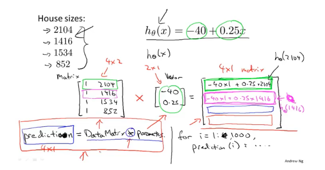
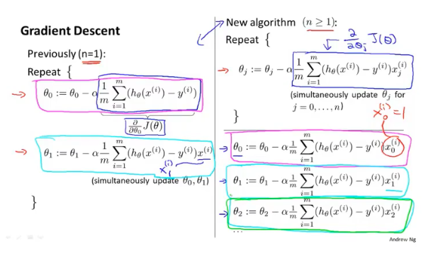
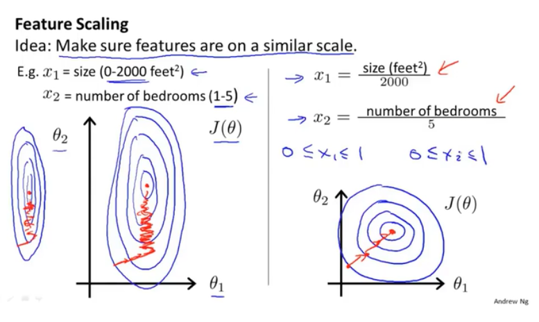
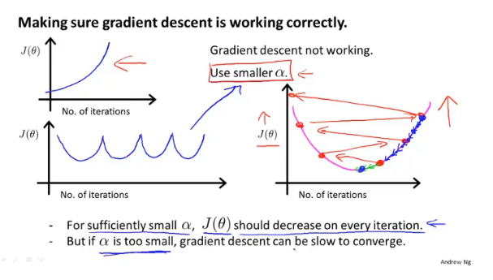

# 机器学习——吴恩达

[视频链接](https://www.bilibili.com/video/BV164411b7dx)：总时长19:24:24，112P。

开始时间：2020-8-25

计划完成：2020-9-30

实际完成：

## 2-2 代价函数

平方误差代价函数（MSE）是解决回归问题最常用的代价函数。除的个数（即分母）可带一个2，其意义在于使得求导之后的形式更理想。

## 2-5 梯度下降

梯度下降计算的过程中，需要在一步内==同时==完成所有参数的更新之后，再重新计算代价函数（损失函数）的值。

## 3-3 矩阵向量乘法

在实现中，尽可能通过矩阵（pytorch中就是tensor）相乘来完成对于多个输入值的函数结果计算，相比于简单循环可以有助于提高效率与简化代码。==视频5-6==（效率的改进主要来源于：编程语言的线性代数函数库经过优化、并行计算）

## 3-5 逆和转置

逆矩阵、伴随矩阵（代数余子式）

## 4-2 多元梯度下降法

左侧为$y=f(\theta)$形式，仅一个参数；右侧为$y=f(\theta_1,\theta_2,\theta_3,...)$形式，含多个参数。

对于多个参数的梯度下降法，每一步中均完成更新所有参数。

## 4-3 多元梯度下降法——特征缩放

使得不同的特征，具备相近的取值范围。

不同特征取值范围相差很大，会导致梯度下降过程中不断波动。

通常归一化会将各特征的取值范围限定到0\~1之间或者-1\~+1之间。

均值归一化：$average_{size}$=1000；$x_1=\frac{size-1000}{2000}$，-0.5$\leq{x_1}\leq$0.5

对于各数值减去均值，再除以范围.

**使用特征缩放的最终目的是使得梯度下降方法运行的更快。**

## 4-4 多元梯度下降法——学习率

损失函数的值随着迭代次数的增长反而呈现出增长的趋势，可能意味着应该选取更小的学习率。

如果损失函数的值随着迭代次数不断起伏，可能也意味着应该选取更小的学习率。

尝试不同的学习率，听过绘制损失函数曲线图，评判不同学习率下的效果。找到一个明显过大的学习率，再找到一个明显过小的学习率，然后取中间最大或者偏大的学习率作为最终采用的结果。

一种学习率尝试过程：0.001 --> 0.003 --> 0.01 --> 0.03 --> 0.1

