# 可计算导论

## 计算理论引论

1. **自动机**
2. **可计算语言**
3. 计算复杂性

罗素悖论、理发师悖论：”既当裁判员，又当运动员“。

罗素悖论：

​	A类：以自身为元素的集合

​	B类：不以自身为元素的集合	设：R={B类}

1.	R$\in$A =>（使用A类集合的定义推出） R$\in$R => R$\in$B
 	2.	R$\in$B => R$\in$R => R$\in$A

说谎者悖论：”本语句为假“（自我否定）

产生悖论矛盾的来源：

- 自我否定
- 自引用否定

命题与多义句：ppt01_page12  两个貌似互相矛盾命题的多义句的不合逻辑的相互推出，不是真正意义上的悖论。两个貌似相互矛盾命题的多义句的不合逻辑的相互推出，不是真正意义上的悖论。

“本语句为假”既真且假，因而不是命题而是多义句。ppt01_page14

Power set（幂集）：由A的所有子集构成的集合（包括全集和空集）     |A|=n

1. 通过组合数学的角度进行理解：从n个中选0，1，2。。。个，可得|P(A)|=$2^n$
2. 通过计算机的角度进行理解：子集编码，每一位上表示是否选择A集合中的该元素，总共有n位，所以是$2^n$种

$\sum$ 字母表（是一个集合）；由$\sum$中字母组成的字符串：词（不是集合，无穷多）；由若干个词组成的集合：语言（是一个集合，无穷多）

设$\sum$是字母表，则称$2^\sum$（指的是不考虑语法的情况下，使用字母表$\sum$所能构成的词的集合，个数为无限个，因为可以重复使用）的子集A为$\sum$上的语言。

两个词链接所得到的结果唯一，但是无法从两个词的链接结果确定其是由哪两个词链接所得。

函数：$f:A$->$B$  映射：单射、满射、双射（单且满）

关系：**自反**、反自反、**对称**、反对称、**传递**

A到B的关系：A*B的子集

A上的关系：A*A的子集

自反：

| R    | a    | b    | c    |
| ---- | ---- | ---- | ---- |
| a    | 1    |      |      |
| b    |      | 1    |      |
| c    |      |      | 1    |

对称：

| R    | a    | b    | c    |
| ---- | ---- | ---- | ---- |
| a    |      | 1    |      |
| b    | 1    |      |      |
| c    |      |      |      |

传递：<a,b>,<b,c> => <a,c>

自动机实质：现状+输入->下一状态

有穷自动机所确定的序列称为状态序列。当输入序列的长度为n，则状态长度为n+1。

确定的有穷自动机（DFA）由一个五元组进行表示：M=(Q,$\sum$,$\delta$,$q_0$,F)

Q：有限状态集（**集合**）、$\sum$：有限字母表（**集合**），$\delta$：转换函数，$q_0$：始态，F：受态（**集合**）

转换函数用矩阵

|       | 0     | 1     |
| ----- | ----- | ----- |
| $q_1$ | $q_1$ | $q_2$ |
| $q_2$ | $q_3$ | $q_2$ |
| $q_2$ | $q_2$ | $q_2$ |

w=$w_1$...$w_n$$\in$L(M)（正则语言）；接受状态序列为$r_0$、$r_1$...$r_n$；M=(Q,$\sum$,$\delta$,$q_0$,F)

接受状态序列三要求：

1. $r_0$=$q_0$
2. $r_{i+1}=\delta(r_i,w_{i+1})$
3. $r_n\in$F

正则语言：连接，并，星

**正则语言之并集仍正则；正则语言之链接仍正则**

不确定性自动机：并行C语言描述ppt01_page60

NFA也使用五元组进行表示。区别在于：（1）转换中可以有空($\epsilon$)（但是有限字母表集合中并不包含$\epsilon$），转换函数可以转换到不止一个状态；（2）DFA有唯一初态，NFA为初始状态集。

DFA的每一个状态对于字母表中的每一个符号总是恰好有一个转移箭头射出；NFA中，一个状态对于字母表中的每一个符号可能有0个、1个或多个射出的箭头。

NFA转换函数的矩阵

|       | 0       | 1           | $\epsilon$ |
| ----- | ------- | ----------- | ---------- |
| $q_1$ | {$q_1$} |             |            |
| $q_2$ |         | $\emptyset$ |            |
| $q_3$ |         |             |            |
| $q_4$ |         |             |            |

**表中的每一格内容所填的均是一个集合。**

[NFA到DFA的修改](https://www.jianshu.com/p/9045f4b9c532)（包含NFA到DFA以及DFA的简化）：先将原本的始态即经过$\epsilon$所能到达的所有状态都放在一起，形成一个新的始态，随后根据变换写表格。最后勿忘简化DFA。 （参考网站中流程正确，但是实例有错）

**DFA的简化：算法**（参考网站中包含实例解释）

1. 将得到的状态进行划分 ∏ ，划分为两部分，一部分为接收态，一部分为为非接收态组。
2. 继续进行划分，通过其可以匹配的字符进行判断，若该组内所有成员匹配字符都落在同一组内，即不可再分，否则重新划分组
3. 若 ∏new = ∏ ，则进入步骤4，否则返回2
4. 在分组 ∏new 每个组中选取一个状态作为代表，代表DFA的最简状态。

==正则运算：并，连结，星（**交，补满足正则性，但不是正则运算**）==

## 正则语言

正则语言与正则表达式等价（对于最基本的正则表达式，均可以用DFA表示，而正则语言的定义是递归的  P41）

DFA->[GNFA](https://blog.csdn.net/shulianghan/article/details/106173569)：

- 加入$q_s$和$q_q$，作为新的起始状态和终止状态。（DFA的一个初态和多个终态，分别连接到$q_s$和$q_a$）
- 删除中间状态（除$q_s$和$q_q$），直到只有$q_s$和$q_q$

**① 非确定性有限自动机 ( NFA ) :** 箭头上 只能出现 字符 , 空字符串 , 2 种输入 , 不能出现其它输入内容 ;

**② 推广型的非确定性有限自动机 ( GNFA ) :** 箭头上 可以出现 字符 , 空字符串 , 空集 , 正则表达式 , 4 种输入 ;

$\epsilon*R=R$   $\epsilon\cup R$（就是自身，不能舍弃$\epsilon$）

$\phi*R=\phi$   $\phi\cup R =R$

## 泵引理

证明非正则性的技术源于一个关于正则语言的定理，通常把它称为泵引理。

经得起泵测试（容忍罗嗦） 是RL的必要条件（不充分）：RL正则语言一定能通过泵测试，但是通过泵测试的并不一定都是RL正则语言。

相关证明page47

**总结（反证法）：泵定理技巧，一个元素在RL中 -> 打圈的无穷个也在RL中，经不起泵测试就不是RL。矛盾**ppt02_page21

## 乔姆斯基范式

$w = w_1w_2....w_n$

A->BC  &  B->$a_1$

范式构成的树高：$h_{max}=n+1$  else  $log_2n\leq h \leq n+1$

**所有的上下文无关语言都可以使用乔姆斯基范式的语法进行描述：**

**修改方法与过程：ppt03_page31~32**

## 正则语言属于上下文无关语言（RL$\in$CFL）

证明：ppt03_page35~36

证明思路：RL -> DFA -> 造CFG

给定一个DFA M=(Q,$\sum$,$\delta$,$q_0$,F)，可以构造一个对应的上下文无关文法$G_M$=(V,$\sum$,R,S)

其中V=Q，S=$q_0$  状态集相等，初态对应（字母集相同）

- $q_i$ -> $x\delta(q_i,x)$       for all $q_i\in$V and all x$\in\sum$

- $q_i$ -> $\epsilon$       for all $q_i\in$F（终止态）

CFG的规则对应于自动机的边

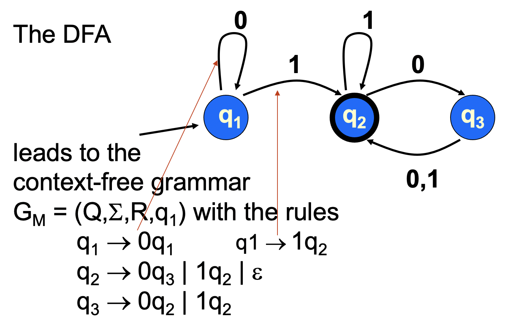

## 下推自动机（PDA）

PDA：描述CFL的设备

“硬件” 增加了栈；对应于 可用 if ，goto, 读，和栈操作 的C程序

下推自动机使用六元组进行表示(Q,$\sum$,$\Gamma$,$q_0$,F,$\delta$)：书P70详细解释

- Q 有限状态集
- $\sum$有限字母表
- $\Gamma$可压栈字符表
- $q_0$初始状态
- F接受状态
- $\delta$**状态转移函数**（相当于3种语句goto,push,pop）
  - $\delta$:Q$\times\sum_\epsilon\times\Gamma_{\epsilon}$ -> $P(Q\times\Gamma_{\epsilon})$
  - 转移函数通过返回$Q\times\Gamma_{\epsilon}$的一个子集，即$P(Q\times\Gamma_{\epsilon})$的一个成员来体现转移动作的非确定性

“a,b -> c”表示当机器从输入中读到a时可以用c替换栈顶的符号b。

入栈时，指针指向栈顶元素上方的空（$\epsilon$）；出栈时，指针指向栈顶元素。

## 上下文无关文法的泵引理

证明：ppt04_page20~21

**CFL对并运算封闭：**

证明：

Assume that the two grammars are G1=(V1,$\sum$,R1,S1) and G2=(V2,$\sum$,R2,S2).

Construct a third grammar G3=(V3,$\sum$,R3,S3) by:

 V3 = V1 $\cup$ V2 $\cup$ { S3 }  (new start variable) with R3 = R1 $\cup$ R2  $\cup$ { S3 -> S1 | S2 }.

It follows that L(G3) = L(G1) $\cup$ L(G2).

对于两个上下文无关语言进行**交运算**和**补运算**，得到的结果不是上下文无关语言。

## 图灵机

有穷自动机能力最弱，其次是下推自动机，图灵机能力最强。

图灵机的三种前途：接受、拒绝、死循环（有穷自动机和下推自动机不存在死循环）

图灵机的形式化定义为7元组（多**带字母表**和**拒绝状态**）；有穷自动机的形式化定义为5元组；下推自动机为6元组（多一个**栈字母表**）

格局演进： 

- $\delta$($q_i$,b) = ($q_j$,c,R)  把当前b改为c且右移      $uaq_ibv$推出$uacq_jv$，当且仅当$\delta$($q_i$,b) = ($q_j$,c,R)
- $\delta$($q_i$,b) = ($q_j$,c,L)  把当前b改为c且左移      $uaq_ibv$推出$uq_jacv$，当且仅当$\delta$($q_i$,b) = ($q_j$,c,L)

## 对称差

两集合相等 <---> 对称差为空

# 考试范围

第一节到第六节

# 历年卷

## 14~15

1. 字母表是任意的一个**有穷集合**，字符串是字母表中符号的**有穷序列**，长度为零的字符串是**空串**，语言是**字符串的集合**
2. 有穷自动机的形式定义是一个5元组，下推动自动的形式定义是一个6元组（增加**栈字母表**），图灵机的形式定义是一个7元组（增加**带字母表**与**拒绝状态**）。
3. 设A和B是两个集合，若函数f:A->B是一个对应，则两个集合的**规模**相等，若其中的A为自然数集，则称B为**可数的**。
4. TM在一个输入w上停机时，则TM的状态可能停在**接受**或**拒绝**
5. 正则运算有**连结**、**并**、**星号**。（**交和补满足正则性，但不是正则运算**）
6. 上下文无关文法中的替换规则是由**变元**和**终结字符**构成的。
7. 图灵机可以有多个接受状态和拒绝状态。  （F） **图灵机的接受状态和拒接状态均唯一，并且二者不相同，因此图灵机至少有两个状态。**
8. 图灵机的读写头能在连续的两步中处于同一个位置。  （T）  **当读写头处于左端点时，如果向左转移，因为机器不允许从带左端移出，因此下一格局读写头仍在左端点。（带无限长，不存在右端点）**
9. 对于任意长度的字符串，都是可以将其压缩的。  **（F）**  **压缩有限制条件，不是任意的**
10. 不可能制造出能够打印出它自己的描述的图灵机。  **（F）**  **可以打印出**
11. 如果A<=mB且B是不可判定的，则A也是不可判定的。  **（F）**  **大的不可判，小的不一定不可判，小的不可判，大的一定不可判**

上下文无关文法泵引理：

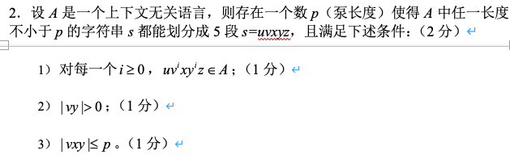

**证明语言不是正则：使用泵引理**

**对角线法则证明不可数，对角线法则证明$A_{TM}$不可判**

## 16~17

1. 图灵机的形式化定义是一个7元组，分别是：**状态集、输入字母表、栈字母表、转移函数、起始状态、接受状态、拒绝状态**

2. 设A和B是两个集合，若函数f:A->B是一个对应，则两个集合的规模相等，若其中的A为自然数集，则称B为可数的

3. 正则运算有连结、并、星号

4. 在图灵机的计算过程中，由**当前状态**、**当前带内容**和**读写头当前位置**的组合，称为图灵机的格局。

5. 图灵机只能有多个的接受状态和拒绝状态  （F）

6. 在任何上下文无关文法G中，字符串w都有唯一的派生  （F）

7. 对于任意长度的字符串，都是可以将其压缩的  （F）

8. 能够制造出一个图灵机，它打印出它自己的描述  （T）

9. 如果A<=mB且B是不可判定的，则A也是不可判定的  （F）

10. 叙述确定型图灵机上的接受格局序列C1,C2,...,Ck的性质

    1)	C1是M在输入w上的起始格局

    2)	每一个Ci产生Ci+1

    3)	Ck是接受格局

11. **大题5**

## 17~18

1. 字母表是任意的一个有穷集合，字符串是字母表中符号的有穷序列，长度为零的字符串是空串，语言是字符串的集合。
2. 将字符串1010和0101分别输入简答题3中给出的有限自动机，其结果分别是接受和拒绝
3. 设A和B是两个集合，若函数f:A->B是一个对应，则两个集合的规模相等，若其中的A为自然数集，则称B为可数的
4. TM在一个输入w上运行时，则可能出现的结果为接受、拒绝和死循环。
5. 正则语言在正则运算连结、并和星号下是封闭的。
6. 上下文无关文法中的替换规则是由**变元**和**终结字符**构成的。
7. 任何上下文无关文法G，在诞生过程中产生的歧义都可以通过最左派生来消除。  **（F）**  **歧义指的是上下文无关文法中有两个或两个以上不同的最左派生**
8. 每一个非确定型图灵机都等价于某一个多带图灵机。  （T）
9. 对于任意长度的字符串，都存在不可压缩的串。  **（T）  定理6.26：对于每个长度，都存在不可压缩的串**
10. 不可能制造出能够打印出它自己的描述的图灵机  （F）
11. 如果A<=mB且B不可判定的，则A也是不可判定的。  （F）
12. **简答题2：递归定理**
13. **证明题2：正则语言类在并运算下封闭**

## 祖传背诵

19：证明 $A_{TM}$不可判

​	$A_{TM}$={<M,w>|M是一个TM，且M接受w}

​	证明：假设$A_{TM}$是可判定的

​	1）H是A_{TM}的判定器。M是一个TM，w是一个串

​	H(<M,w>)=接受   如果M接受w

​                       拒绝   如果M不接受w

​	2）D是一个TM

​	D= “ 对于输入<M>，其中M是一个TM：

​		1）在输入<M,<M>>上运行H

​		2）输出与H的输出相反的结论，即：

​			如果H接受，就拒绝；如果H拒绝就接受。”

​	由以上得：D(<M>)= 接受  如果M不接受<M>

​                                       拒绝  如果M接受<M> 

​	3）当D以D的描述<D>作为输入来运行时，

​		D(<D>)= 接受  如果D不接受<D>

​                        拒绝  如果D接受<D>

​	所以得到矛盾，所以TM D和TM H都不存在，所以$A_{TM}$不可判

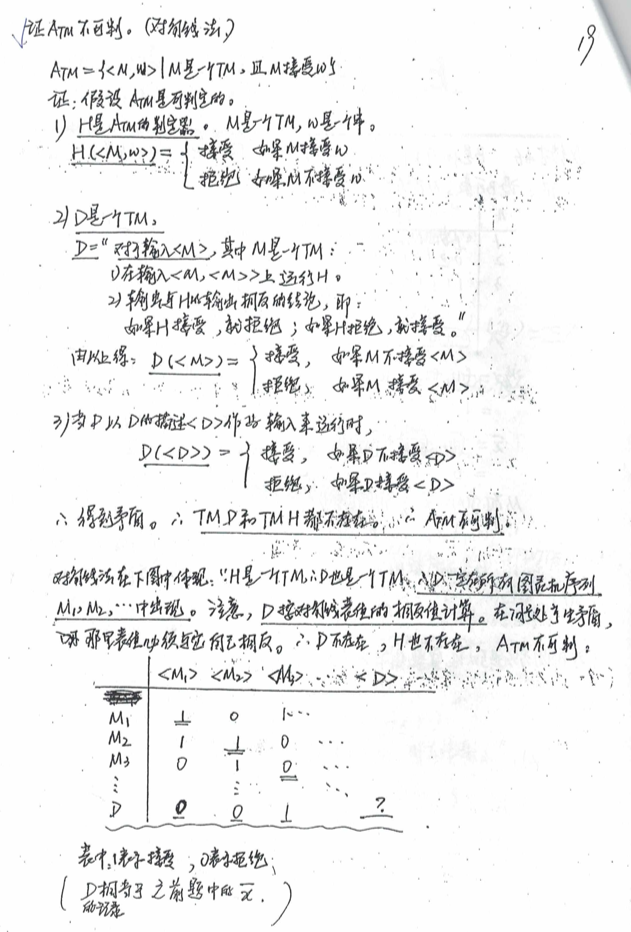

22：**递归定理**、不可压缩性

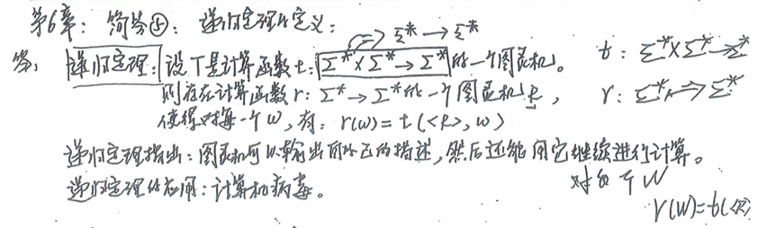

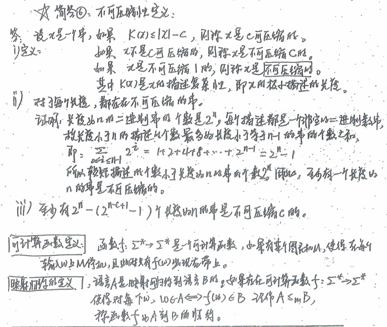

## 判断

2.识别A1$\cup$A2的M的Q=Q1*Q2，而不是Q1$\cup$Q2   (T)

3.正则语言的子集也是正则语言  (F)    0*1*、$0^n1^n$

5.不被图灵机拒绝的就是可识别的  (T)

6.**TM搜索广度（T）深度（F）**

7.**自我否定引用，只可证“判定问题”，不可证“识别问题”  (T)**

8.**映射归约一定是图灵归约，反之不真  (T)**

10.有限个词的语言一定是正则的  (T)

11.**如果A<=TB且B是可判定的，则A也是可判定的  (T)**

12.**如果A<=TB且B是可识别的，则A也是可识别的  (F)**

13.图灵机能在它的带子上写下它的符  (T)

16.有穷自动机可以只包含一个状态  (T)

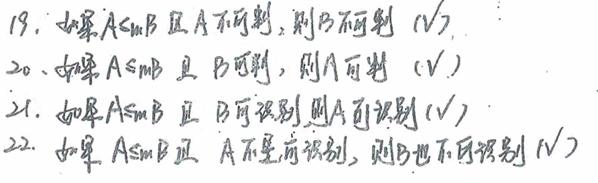

**DFA与NFA状态序列的性质：**

集合是一组**对象**，把它看成一个整体。集合中的对象成为它的**元素**或**成员**。

函数是一个建立输入-输出关系的对象。定义域：输入，值域：输出

定义域的$A^k$的谓词称为关系，称之为k元关系，也称为A上的k源关系

语言：字符串的集合

空集：没有任何元素的集合

空串：长度为零的字符串

NFA的不确定性因素：

1. 一入多出
2. 边为空（无入状态）
3. 一入无出

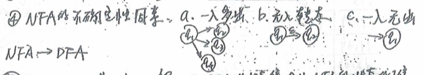

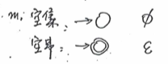

上下文无关文法是一个4元组：

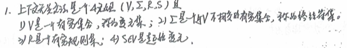

如果字符串w在上下文无关文法中有两个或两个以上不同的最左派生，则称为歧义的

某些上下文无关语言，只能用歧义文法产生，这样的语言称为固有歧义的

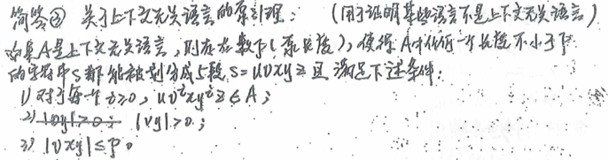

**{w|w的长度为奇数}**

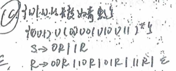

图灵机：无限大容量的存储且任意访问内部数据

有穷自动机与图灵机的区别：

1. 图灵机在带子上既能读又能写
2. 图灵机的读写头既能向左也能向右移动
3. 图灵机的带子无限长
4. 图灵机进入拒绝和接受状态将立即停机

算法：有限步内求真解的过程

**可判定指接受/拒绝——停机问题**

**可识别指接受/死循环——接受问题**

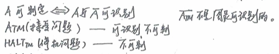

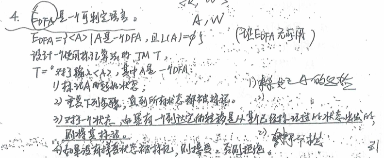

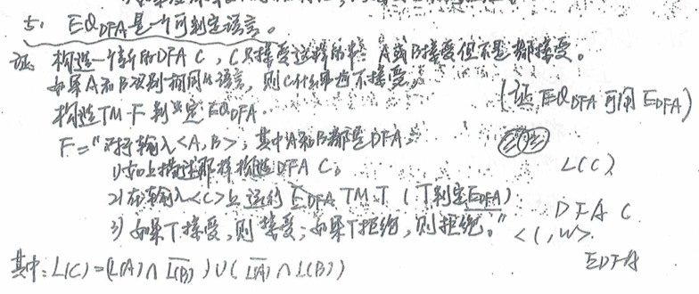

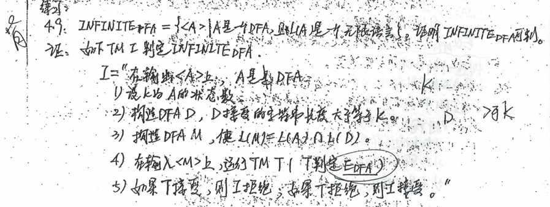

