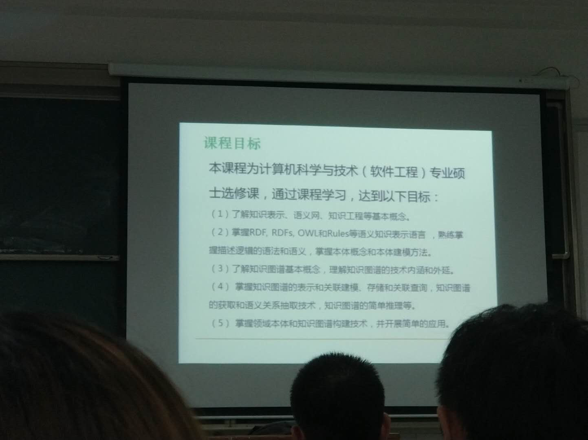
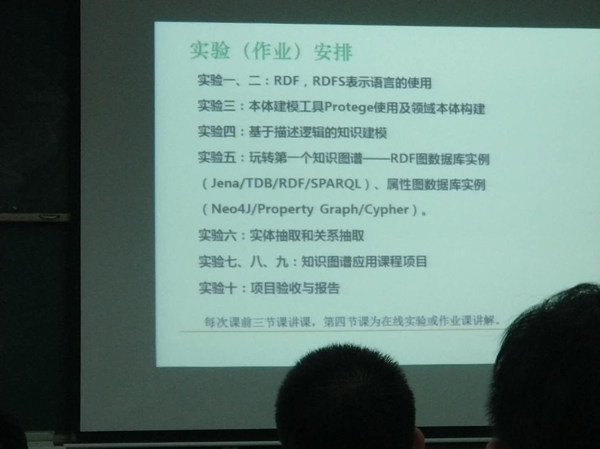
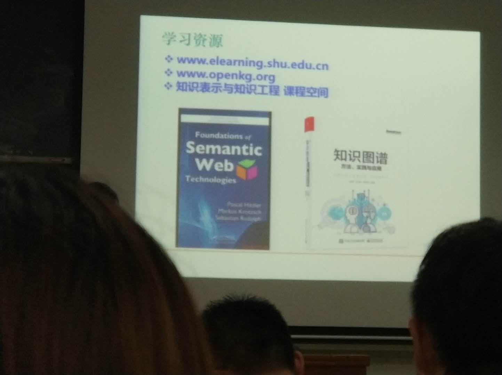

# 知识表示与与知识工程

## 知识表示与语义网

知识表示：对知识的一种描述、一组约定（为描述世界所做的一组约定），一种计算机可以接受的用于描述知识的数据结构。

知识表示=数据结构+处理机制

基于语义的搜索

- 搜索者的意图理解
- 基于概念的搜索
- 结构化的搜索结果
- 上下文扩展

## RDF（资源描述框架）

XML为树状结构，在对XML中的树状信息进行合并时，会急剧膨胀，从而变得累赘。

RDF使用（有向）图作为数据模型。RDF把对象之间的关系作为构建信息的基础，大量这样的实体关系很自然地构成了图，而不是层次化的树结构。

RDF：

- URIs
- Literals 文字
- Empty nodes 空节点

RDF的表达能力有限，无法区分类和对象，也无法定义和描述类的关系/属性。

RDF是对具体事物的描述，缺乏抽象能力，无法对同一个类别的事物进行定义和描述。