# 西瓜书随笔

## 训练集、测试集、验证集

训练集（训练）-->验证集-->得到结果（调参）-->训练集-->....

调参到满意之后，在测试集上验证

**验证集添加的目的是为了调参**

**存在训练集和测试集的目的是为了检测泛化能力**

## 查准率、查全率

TP：真正例

FP：假正例

FN：假反例

TN：真反例

查准率 P-percision  $P=\frac{TP}{TP+FP}$

查全率 R-recall  $R=\frac{TP}{TP+FN}$

**数据集非均匀情况下的验证，[详见](https://www.bilibili.com/video/BV17J411C7zZ?p=13)P13视频：使用普通准确率衡量失效（全部判断不是5也能得到较高准确率；二分类问题，是5和不是5）**

P与R反向关系图解：

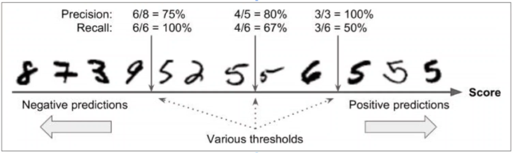

## $F_1$度量

$F_1$是基于查准率与查全率的调和平均定义的：$\frac{1}{F_1}=\frac{1}{2}(\frac{1}{R}+\frac{1}{P})$；进而得出$F_1=\frac{2*P*R}{P+R}=\frac{2*TP}{样例总数+TP-TN}$

## ==$F_\beta$度量==

**其中$\beta$>0度量了查全率对查准率的相对重要性。$\beta$=1时，退化为标准的$F_1$；$\beta$>1时查全率有更大影响；$\beta$<1时查准率有更大影响。**

$F_\beta$是加权调和平均：$\frac{1}{F_\beta}=\frac{1}{1+\beta^2}(\frac{1}{P}+\frac{\beta^2}{R})=\frac{1}{1+\beta^2}(\frac{TP+FP}{TP}+\frac{\beta^2(TP+TN)}{TP})$

$F_\beta=\frac{TP(1+\beta^2)}{TP+FP+\beta^2(TP+TN)}$

**与算数平均和几何平均相比，调和平均更重视较小值**

==**以上两项均为针对二分类情况**==

## 多分类指标衡量

1. 先分别计算，再求平均值
2. 先平均再计算

## ROC曲线

[P18](https://www.bilibili.com/video/BV17J411C7zZ?p=18)：视频中的理解画图部分有错误，红线和蓝线应该同时收束到一个点(1,1)上。

同趋势变化：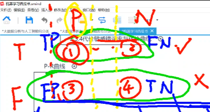阈值限制的变动（竖虚线）。阈值的理解可参考下图

$TPR=\frac{TP}{TP+FN}$可以理解为好，$FPR=\frac{FP}{TN+FP}$可以理解为坏。肯定希望在同样好的情况下坏的更小，或者在同样坏的情况下更好。

## AUC与rank-loss

结合视频理解吧，视频里面讲得很形象了，[P19](https://www.bilibili.com/video/BV17J411C7zZ?p=19)、[P20](https://www.bilibili.com/video/BV17J411C7zZ?p=20) 

## ==代价敏感错误率与代价曲线==

1. 使用$p*cost_{01}$而不是$p$保证的是让关系图中为直线，而不是曲线（如果用$p$就是曲线）

2. 分母归一化，保证使用不同$cost$描绘出的直线左右两端最高处等高（不然的话另一个$cost_{01}$代价是10，那不就右边还有横轴拉满，那还怎么比！）

   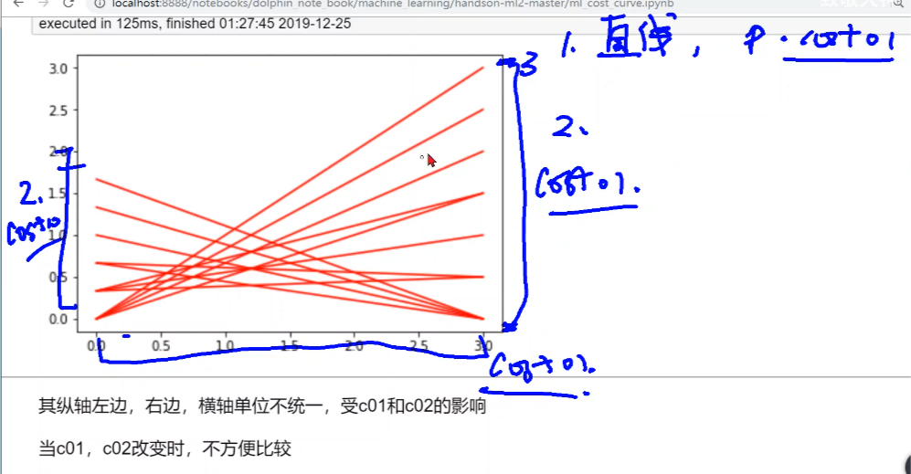

## 多个测试集一种算法假设检验

概率论的t分布理解：

## 多元线性回归推导（来自南瓜书，详见github）

$$\cfrac{\partial E_{\hat{\boldsymbol w}}}{\partial \hat{\boldsymbol  w}}=2\mathbf{X}^{\mathrm{T}}(\mathbf{X}\hat{\boldsymbol  w}-\boldsymbol{y})$$ [推导]：将$E_{\hat{\boldsymbol  w}}=(\boldsymbol{y}-\mathbf{X}\hat{\boldsymbol  w})^{\mathrm{T}}(\boldsymbol{y}-\mathbf{X}\hat{\boldsymbol w})$展开可得 $$E_{\hat{\boldsymbol w}}=  \boldsymbol{y}^{\mathrm{T}}\boldsymbol{y}-\boldsymbol{y}^{\mathrm{T}}\mathbf{X}\hat{\boldsymbol w}-\hat{\boldsymbol  w}^{\mathrm{T}}\mathbf{X}^{\mathrm{T}}\boldsymbol{y}+\hat{\boldsymbol  w}^{\mathrm{T}}\mathbf{X}^{\mathrm{T}}\mathbf{X}\hat{\boldsymbol w}$$ 对$\hat{\boldsymbol w}$求导可得 $$\cfrac{\partial E_{\hat{\boldsymbol w}}}{\partial \hat{\boldsymbol  w}}= \cfrac{\partial \boldsymbol{y}^{\mathrm{T}}\boldsymbol{y}}{\partial \hat{\boldsymbol w}}-\cfrac{\partial  \boldsymbol{y}^{\mathrm{T}}\mathbf{X}\hat{\boldsymbol w}}{\partial  \hat{\boldsymbol w}}-\cfrac{\partial \hat{\boldsymbol  w}^{\mathrm{T}}\mathbf{X}^{\mathrm{T}}\boldsymbol{y}}{\partial  \hat{\boldsymbol w}}+\cfrac{\partial \hat{\boldsymbol  w}^{\mathrm{T}}\mathbf{X}^{\mathrm{T}}\mathbf{X}\hat{\boldsymbol  w}}{\partial \hat{\boldsymbol w}}$$ 由==矩阵微分公式==$\cfrac{\partial\boldsymbol{a}^{\mathrm{T}}\boldsymbol{x}}{\partial\boldsymbol{x}}=\cfrac{\partial\boldsymbol{x}^{\mathrm{T}}\boldsymbol{a}}{\partial\boldsymbol{x}}=\boldsymbol{a},\cfrac{\partial\boldsymbol{x}^{\mathrm{T}}\mathbf{A}\boldsymbol{x}}{\partial\boldsymbol{x}}=(\mathbf{A}+\mathbf{A}^{\mathrm{T}})\boldsymbol{x}$可得 $$\cfrac{\partial E_{\hat{\boldsymbol w}}}{\partial \hat{\boldsymbol  w}}=  0-\mathbf{X}^{\mathrm{T}}\boldsymbol{y}-\mathbf{X}^{\mathrm{T}}\boldsymbol{y}+(\mathbf{X}^{\mathrm{T}}\mathbf{X}+\mathbf{X}^{\mathrm{T}}\mathbf{X})\hat{\boldsymbol w}$$ $$\cfrac{\partial E_{\hat{\boldsymbol w}}}{\partial \hat{\boldsymbol  w}}=2\mathbf{X}^{\mathrm{T}}(\mathbf{X}\hat{\boldsymbol  w}-\boldsymbol{y})$$

## [$l_p$范数](https://zhuanlan.zhihu.com/p/26884695)

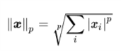

[意义解释](https://www.cnblogs.com/Vancuicide/p/9982212.html)

## 局部最优与全局最优

凸优化：（只是当下的理解）损失函数设置为一个凸函数，就可以实现保证局部最优就是全局最优，本质上是对于损失函数进行数学改造来避免梯度下降过程中未找到全局最优而陷入局部最优解。

## 遗传算法、模拟退火

[参考博客](https://www.jianshu.com/p/ae5157c26af9)

下面介绍介绍“袋鼠跳”的几种方式。

- 爬山算法：一只袋鼠朝着比现在高的地方跳去。它找到了不远处的最高的山峰。但是这座山不一定是最高峰。这就是爬山算法，它不能保证局部最优值就是全局最优值。
- 模拟退火：袋鼠喝醉了。它随机地跳了很长时间。这期间，它可能走向高处，也可能踏入平地。但是，它渐渐清醒了并朝最高峰跳去。这就是模拟退火算法。
- 遗传算法：有很多袋鼠，它们降落到喜玛拉雅山脉的任意地方。这些袋鼠并不知道它们的任务是寻找珠穆朗玛峰。但每过几年，就在一些海拔高度较低的地方射杀一些袋鼠。于是，不断有袋鼠死于海拔较低的地方，而越是在海拔高的袋鼠越是能活得更久，也越有机会生儿育女。就这样经过许多年，这些袋鼠们竟然都不自觉地聚拢到了一个个的山峰上，可是在所有的袋鼠中，只有聚拢到珠穆朗玛峰的袋鼠被带回了美丽的澳洲。

## 熵的度量，信息熵

视频P52-P54 + [知乎源视频](https://www.zhihu.com/question/22178202)

**熵的度量：一般分布  P54**  具体解释了知乎视频里面对于概率取倒数内容的细致理解：原本的6个等可能情况在进入1/2时（相当于可以被拆成3个等可能的1/6），减少了一件3种等可能事件情况。（感觉概括的不大好，还是看原视频理解吧）

弹幕中的概括：因为一旦走了A的路线，那三种情况就是确定的了，而我们计算熵的时候用$log_26$，强行认为都是等可能的不确定，所以最后要扣除

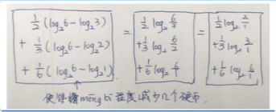

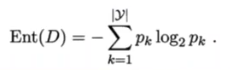

## CART分类树算法

[参考博客1](https://www.cnblogs.com/keye/p/10564914.html)(含实例，可结合理解)

​		**CART分类树算法对连续值的处理**，思想和C4.5相同，都是将连续的特征离散化。唯一区别在选择划分点时，C4.5是信息增益比，CART是基尼系数。

　　具体思路：m个样本的连续特征A有m个，从小到大排列a1，a2，......，am，则CART取相邻两样本值的平均数做划分点，一共取m-1个，其中第i个划分点Ti表示为：Ti = (ai + ai+1)/2。分别计算以这m-1个点作为二元分类点时的基尼系数。选择基尼系数最小的点为该连续特征的二元离散分类点。比如取到的基尼系数最小的点为at，则小于at的值为类别1，大于at的值为类别2，这样就做到了连续特征的离散化。

　　注意的是，与ID3、C4.5处理离散属性不同的是，如果当前节点为连续属性，则该属性在后面还可以参与子节点的产生选择过程。

　　**CART分类树算法对离散值的处理**，采用的思路：不停的二分离散特征。

　　在ID3、C4.5，特征A被选取建立决策树节点，如果它有3个类别A1,A2,A3，我们会在决策树上建立一个三叉点，这样决策树是多叉树。

　　CART采用的是不停的二分。会考虑把特征A分成{A1}和{A2,A3}、{A2}和{A1,A3}、{A3}和{A1,A2}三种情况，找到基尼系数最小的组合，比如{A2}和{A1,A3}，然后建立二叉树节点，一个节点是A2对应的样本，另一个节点是{A1,A3}对应的样本。由于这次没有把特征A的取值完全分开，后面还有机会对子节点继续选择特征A划分A1和A3。这和ID3、C4.5不同，在ID3或C4.5的一颗子树中，离散特征只会参与一次节点的建立。

[参考博客2](https://blog.csdn.net/lanyuelvyun/article/details/88697386)

## KKT条件

**最简单的概括：==一个不等式约束条件换三个式子==**

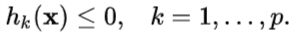    ------->    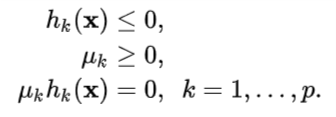

[参考博客](https://zhuanlan.zhihu.com/p/38163970)

**不等式约束优化问题**

接下来我们将约束等式 ![[公式]](https://www.zhihu.com/equation?tex=g%28%5Cmathbf%7Bx%7D%29%3D0) 推广为不等式 ![[公式]](https://www.zhihu.com/equation?tex=g%28%5Cmathbf%7Bx%7D%29%5Cle+0) 。考虑这个问题

![[公式]](https://www.zhihu.com/equation?tex=%5Cdisplaystyle+%5Cbegin%7Barray%7D%7Bll%7D+%5Chbox%7Bmin%7D%26f%28%5Cmathbf%7Bx%7D%29%5C%5C+%5Chbox%7Bs.t.%7D%26g%28%5Cmathbf%7Bx%7D%29%5Cle+0.+%5Cend%7Barray%7D%5C%5C) 
约束不等式 ![[公式]](https://www.zhihu.com/equation?tex=g%28%5Cmathbf%7Bx%7D%29%5Cle+0) 称为原始可行性(primal feasibility)，据此我们定义可行域(feasible region) ![[公式]](https://www.zhihu.com/equation?tex=K%3D%7B%5Cmathbf%7Bx%7D%5Cin%5Cmathbb%7BR%7D%5En%7Cg%28%5Cmathbf%7Bx%7D%29%5Cle+0%7D) 。假设 ![[公式]](https://www.zhihu.com/equation?tex=%5Cmathbf%7Bx%7D%5E%5Cstar) 为满足约束条件的最佳解，分开两种情况讨论：

(1) ![[公式]](https://www.zhihu.com/equation?tex=g%28%5Cmathbf%7Bx%7D%5E%5Cstar%29%3C0) ，最佳解位于 ![[公式]](https://www.zhihu.com/equation?tex=K) 的内部，称为内部解(interior solution)，这时约束条件是无效的(inactive)；

(2) ![[公式]](https://www.zhihu.com/equation?tex=g%28%5Cmathbf%7Bx%7D%5E%5Cstar%29%3D0) ，最佳解落在 ![[公式]](https://www.zhihu.com/equation?tex=K) 的边界，称为边界解(boundary solution)，此时约束条件是有效的(active)。

这两种情况的最佳解具有不同的必要条件。

(1)内部解：在约束条件无效的情形下， ![[公式]](https://www.zhihu.com/equation?tex=g%28%5Cmathbf%7Bx%7D%29) 不起作用，约束优化问题退化为无约束优化问题，因此驻点 ![[公式]](https://www.zhihu.com/equation?tex=%5Cmathbf%7Bx%7D%5E%5Cstar) 满足 ![[公式]](https://www.zhihu.com/equation?tex=%5Cnabla+f+%3D%5Cmathbf%7B0%7D) 且 ![[公式]](https://www.zhihu.com/equation?tex=%5Clambda%3D0) 。

(2)边界解：在约束条件有效的情形下，约束不等式变成等式 ![[公式]](https://www.zhihu.com/equation?tex=g%28%5Cmathbf%7Bx%7D%29%3D0) ，这与前述Lagrange乘数法的情况相同。我们可以证明驻点 ![[公式]](https://www.zhihu.com/equation?tex=%5Cmathbf%7Bx%7D%5E%5Cstar) 发生于 ![[公式]](https://www.zhihu.com/equation?tex=%5Cnabla+f%5Cin%5Chbox%7Bspan%7D%7B%5Cnabla+g%7D) ，换句话说，存在 ![[公式]](https://www.zhihu.com/equation?tex=%5Clambda) 使得 ![[公式]](https://www.zhihu.com/equation?tex=%5Cnabla+f%3D-%5Clambda%5Cnabla+g) ，但这里 ![[公式]](https://www.zhihu.com/equation?tex=%5Clambda) 的正负号是有其意义的。**因为我们希望最小化** ![[公式]](https://www.zhihu.com/equation?tex=f) **，梯度** ![[公式]](https://www.zhihu.com/equation?tex=%5Cnabla+f) **(函数** ![[公式]](https://www.zhihu.com/equation?tex=f) **在点** ![[公式]](https://www.zhihu.com/equation?tex=%5Cmathbf%7Bx%7D) **的最陡上升方向)应该指向可行域** ![[公式]](https://www.zhihu.com/equation?tex=K) **的内部(因为你的最优解最小值是在边界取得的)，但** ![[公式]](https://www.zhihu.com/equation?tex=%5Cnabla+g) **指向** ![[公式]](https://www.zhihu.com/equation?tex=K) **的外部(即** ![[公式]](https://www.zhihu.com/equation?tex=g%28%5Cmathbf%7Bx%7D%29%3E0) **的区域，因为你的约束是小于等于0)，因此** ![[公式]](https://www.zhihu.com/equation?tex=%5Clambda%5Cge+0) **，称为对偶可行性(dual feasibility)**。==（f：想象一个三维空间中凸出来的情形；g：想象一个三维空间中凹下去的情形）==（[相关视频](https://www.bilibili.com/video/BV17J411C7zZ?p=83)）

因此，不论是内部解或边界解， ![[公式]](https://www.zhihu.com/equation?tex=%5Clambda+g%28%5Cmathbf%7Bx%7D%29%3D0) 恒成立，称为互补松弛性(complementary slackness)。整合上述两种情况，最佳解的必要条件包括Lagrangian函数 ![[公式]](https://www.zhihu.com/equation?tex=L%28%5Cmathbf%7Bx%7D%2C%5Clambda%29) 的定常方程式、原始可行性、对偶可行性，以及互补松弛性：

![[公式]](https://www.zhihu.com/equation?tex=%5Cdisplaystyle+%5Cbegin%7Baligned%7D+%5Cnabla_%7B%5Cmathbf%7Bx%7D%7DL%26%3D%5Cnabla+f%2B%5Clambda%5Cnabla+g%3D%5Cmathbf%7B0%7D%5C%5C+g%28%5Cmathbf%7Bx%7D%29%26%5Cle+0%5C%5C+%5Clambda%26+%5Cge+0%5C%5C+%5Clambda+g%28%5Cmathbf%7Bx%7D%29%26%3D0.+%5Cend%7Baligned%7D%5C%5C) 
这些条件合称为Karush-Kuhn-Tucker (KKT)条件。如果我们要最大化 ![[公式]](https://www.zhihu.com/equation?tex=f%28%5Cmathbf%7Bx%7D%29) 且受限于 ![[公式]](https://www.zhihu.com/equation?tex=g%28%5Cmathbf%7Bx%7D%29%5Cle+0) ，那么对偶可行性要改成 ![[公式]](https://www.zhihu.com/equation?tex=%5Clambda%5Cle+0) 。

上面结果可推广至多个约束等式与约束不等式的情况。考虑标准约束优化问题(或称非线性规划)：

![[公式]](https://www.zhihu.com/equation?tex=%5Cdisplaystyle+%5Cbegin%7Barray%7D%7Blll%7D+%5Chbox%7Bmin%7D%26f%28%5Cmathbf%7Bx%7D%29%5C%5C+%5Chbox%7Bs.t.%7D%26g_j%28%5Cmathbf%7Bx%7D%29%3D0%2C%26j%3D1%2C%5Cldots%2Cm+%2C%5C%5C+%26h_k%28%5Cmathbf%7Bx%7D%29%5Cle+0%2C%26k%3D1%2C%5Cldots%2Cp.+%5Cend%7Barray%7D%5C%5C) 

定义Lagrangian 函数

![[公式]](https://www.zhihu.com/equation?tex=%5Cdisplaystyle+L%5Cleft%28%5Cmathbf%7Bx%7D%2C%5C%7B%5Clambda_j%5C%7D%2C%5C%7B%5Cmu_k%5C%7D%5Cright%29%3Df%28%5Cmathbf%7Bx%7D%29%2B%5Csum_%7Bj%3D1%7D%5Em%5Clambda_jg_j%28+%5Cmathbf%7Bx%7D%29%2B%5Csum_%7Bk%3D1%7D%5Ep%5Cmu_kh_k%28%5Cmathbf%7Bx%7D%29%5C%5C) 
其中 ![[公式]](https://www.zhihu.com/equation?tex=%5Clambda_j) 是对应 ![[公式]](https://www.zhihu.com/equation?tex=g_j%28%5Cmathbf%7Bx%7D%29%3D0) 的Lagrange乘数， ![[公式]](https://www.zhihu.com/equation?tex=%5Cmu_k) $是对应 ![[公式]](https://www.zhihu.com/equation?tex=h_k%28%5Cmathbf%7Bx%7D%29%5Cle+0) 的Lagrange乘数(或称KKT乘数)。KKT条件包括

![[公式]](https://www.zhihu.com/equation?tex=%5Cdisplaystyle+%5Cbegin%7Baligned%7D+%5Cnabla_%7B%5Cmathbf%7Bx%7D%7DL%26%3D%5Cmathbf%7B0%7D%5C%5C+g_j%28%5Cmathbf%7Bx%7D%29%26%3D0%2C~~j%3D1%2C%5Cldots%2Cm%2C%5C%5C+h_k%28%5Cmathbf%7Bx%7D%29%26%5Cle+0%2C%5C%5C+%5Cmu_k%26%5Cge+0%2C%5C%5C+%5Cmu_k+h_k%28%5Cmathbf%7Bx%7D%29%26%3D0%2C~~k%3D1%2C%5Cldots%2Cp.+%5Cend+%7Baligned%7D%5C%5C) 

## 支持向量机

[图6.1的理解](https://www.bilibili.com/video/BV17J411C7zZ?p=74)：+和-相当于是第三维上的属性y（隐含了一条轴），通过$x_1$和$x_2$确定第三维的属性，$x_1$和$x_2$在一起相当于是（x,y）里面的$x$，是一个向量，包含两个维度，数值分别对应$x_1$和$x_2$。

**向量表示符号的差别：分号间隔表示列向量，逗号间隔表示横向量**

[拉格朗日乘数法的应用由来与理解](https://www.bilibili.com/video/BV17J411C7zZ?p=79)

公式6.11推导：

$$\begin{aligned} \max_{\boldsymbol{\alpha}} & \sum_{i=1}^m\alpha_i -  \frac{1}{2}\sum_{i = 1}^m\sum_{j=1}^m\alpha_i \alpha_j  y_iy_j\boldsymbol{x}_i^T\boldsymbol{x}_j \ \text { s.t. } & \sum_{i=1}^m \alpha_i y_i =0 \ & \alpha_i \geq 0 \quad i=1,2,\dots ,m \end{aligned}$$
 [推导]：将公式(6.9)和公式(6.10)代入公式(6.8)即可将$L(\boldsymbol{w},b,\boldsymbol{\alpha})$中的$\boldsymbol{w}$和$b$消去，再考虑公式(6.10)的约束，就得到了公式(6.6)的对偶问题 $$\begin{aligned} \inf_{\boldsymbol{w},b} L(\boldsymbol{w},b,\boldsymbol{\alpha})   &=\frac{1}{2}\boldsymbol{w}^T\boldsymbol{w}+\sum_{i=1}^m\alpha_i  -\sum_{i=1}^m\alpha_iy_i\boldsymbol{w}^T\boldsymbol{x}_i-\sum_{i=1}^m\alpha_iy_ib \ &=\frac {1}{2}\boldsymbol{w}^T\sum  _{i=1}^m\alpha_iy_i\boldsymbol{x}_i-\boldsymbol{w}^T\sum  _{i=1}^m\alpha_iy_i\boldsymbol{x}_i+\sum_{i=1}^m\alpha_i -b\sum _{i=1}^m\alpha_iy_i \ & = -\frac {1}{2}\boldsymbol{w}^T\sum _{i=1}^m\alpha_iy_i\boldsymbol{x}_i+\sum_{i=1}^m\alpha_i -b\sum _{i=1}^m\alpha_iy_i \end{aligned}$$ 由于$\sum\limits_{i=1}^{m}\alpha_iy_i=0$，所以上式最后一项可化为0，于是得 $$\begin{aligned} \inf_{\boldsymbol{w},b} L(\boldsymbol{w},b,\boldsymbol{\alpha})  &= -\frac {1}{2}\boldsymbol{w}^T\sum  _{i=1}^m\alpha_iy_i\boldsymbol{x}_i+\sum_{i=1}^m\alpha_i \ &=-\frac {1}{2}(\sum_{i=1}^{m}\alpha_iy_i\boldsymbol{x}_i)^T(\sum _{i=1}^m\alpha_iy_i\boldsymbol{x}_i)+\sum_{i=1}^m\alpha_i \ &=-\frac {1}{2}\sum_{i=1}^{m}\alpha_iy_i\boldsymbol{x}_i^T\sum_{i=1}^m\alpha_iy_i\boldsymbol{x}_i+\sum_{i=1}^m\alpha_i \ &=\sum_{i=1}^m\alpha_i-\frac {1}{2}\sum_{i=1 }^{m}\sum_{j=1}^{m}\alpha_i\alpha_jy_iy_j\boldsymbol{x}_i^T\boldsymbol{x}_j \end{aligned}$$ 所以 $$\max_{\boldsymbol{\alpha}}\inf_{\boldsymbol{w},b} L(\boldsymbol{w},b,\boldsymbol{\alpha})=\max_{\boldsymbol{\alpha}} \sum_{i=1}^m\alpha_i - \frac{1}{2}\sum_{i = 1}^m\sum_{j=1}^m\alpha_i \alpha_j y_iy_j\boldsymbol{x}_i^T\boldsymbol{x}_j $$

### 核函数

**高斯核函数**：[推导过程](https://www.bilibili.com/video/BV17J411C7zZ?p=90)，其中最后代入s的一步应该理解并不准确（不应该是拆成根号的情况，而是应该拆成相乘 的两项），参考下图，拆分出来的两个高维向量应当只包含x或者只包含y，这样才能对应上==$\phi(x_i)^T\phi(x_j)$==的形式。

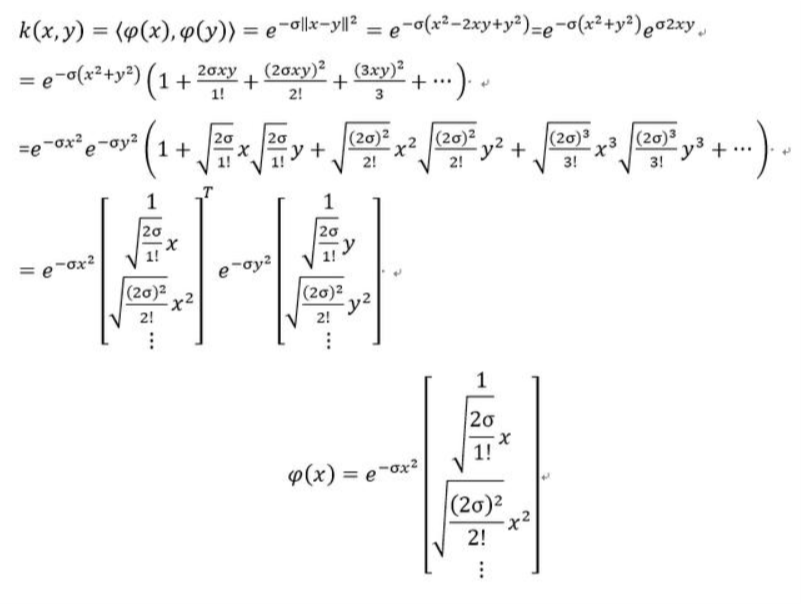

## 经验风险、期望风险、结构风险

[解释博客](https://www.jianshu.com/p/903e35e1c95a)

**为何引入结构化风险？**

虽然可以使用经验损失近似估计期望风险，但是大数定理的前提是N无穷大，实际上，我们的训练集一般不会特别大，此时就需要对经验风险做出适当调整才能近似估计。因此引入结构风险。

结构化风险是为了缓解数据集过小而导致的过拟合现象，其等价于正则化，本质上反应的是模型的复杂度。认为经验风险越小，参数越多，模型越复杂，因此引入对模型复杂度的惩罚机制。

## 贝叶斯定理

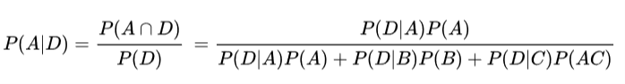

[解释博客](https://www.matongxue.com/madocs/279.html)

**重要条件：朴素贝叶斯算法是假设各个特征之间相互独立**  [原因解释及实例](https://zhuanlan.zhihu.com/p/26262151)  表现形式：多个属性可由连乘来计算

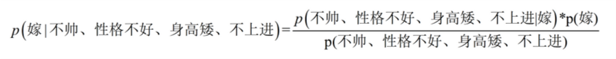

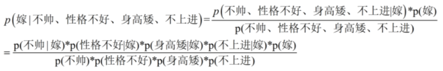

## 朴素贝叶斯法处理连续及离散属性

[关于连续属性处理的实例](https://www.pianshen.com/article/98701166125/)

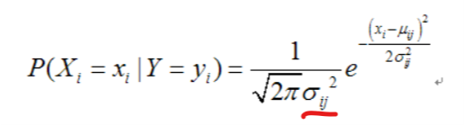

上面那个博客这个地方写错了，是没有平方的，对应书上的式7.18

**疑问：**连续属性为何能使用概率密度去乘  （[相关解释](https://www.zhihu.com/question/51992999)）

**解答：**

作者：342788
链接：https://www.zhihu.com/question/51992999/answer/248807822
来源：知乎

当特征是连续变量的时候，运用多项式模型就会导致很多$P(x_{i}|y_{k})=0$（不做平滑的情况下），此时即使做平滑，所得到的条件概率也难以描述真实情况。所以处理连续的特征变量，应该采用高斯模型。

通过一个例子来说明： [性别分类的例子](https://link.zhihu.com/?target=http%3A//www.ruanyifeng.com/blog/2013/12/naive_bayes_classifier.html) [来自维基](https://link.zhihu.com/?target=https%3A//en.wikipedia.org/wiki/Naive_Bayes_classifier%23Sex_classification)

下面是一组人类身体特征的统计资料。 | 性别 | 身高（英尺） | 体重（磅） |脚掌（英寸）| | :-------------: |:-------------:| :-----:|:-----:| |　男 　|　　6 　　|　　　　180　　|　　　12 | |男 　|　　5.92　　|　　　190　　　|　　11 | |男 　　|　5.58　　|　　　170　　　|　　12 | |　　男 　　|　5.92　|　　　　165　　|　　　10 | |　　女 　　|　5 　|　　　　　100　　　|　　6 | |　　女 　|　　5.5 　　|　　　150　　|　　　8 | |　　女 　|　　5.42　　|　　　130　|　　　　7 | |　　女 　|　　5.75　　|　　　150　|　　　　9|

已知某人身高6英尺、体重130磅，脚掌8英寸，请问该人是男是女？ 根据朴素贝叶斯分类器，计算下面这个式子的值。

```text
P(身高|性别) x P(体重|性别) x P(脚掌|性别) x P(性别)
```

这里的困难在于，由于身高、体重、脚掌都是连续变量，不能采用离散变量的方法计算概率。而且由于样本太少，所以也无法分成区间计算。怎么办？ 这时，可以假设男性和女性的身高、体重、脚掌都是正态分布，通过样本计算出均值和方差，也就是得到正态分布的密度函数。有了密度函数，就可以把值代入，算出某一点的密度函数的值。 比如，男性的身高是均值5.855、方差0.035的正态分布。所以，男性的身高为6英尺的概率的相对值等于1.5789（大于1并没有关系，因为这里是密度函数的值，只用来反映各个值的相对可能性）。


对于脚掌和体重同样可以计算其均值与方差。有了这些数据以后，就可以计算性别的分类了。

```text
  P(身高=6|男) x P(体重=130|男) x P(脚掌=8|男) x P(男) 
　　　　= 6.1984 x e-9
　　P(身高=6|女) x P(体重=130|女) x P(脚掌=8|女) x P(女) 
　　　　= 5.3778 x e-4
```

可以看到，女性的概率比男性要高出将近10000倍，所以判断该人为女性。

**对解答大概概括：**这里用概率密度只是为了表现出其位于附近的可能性大小，最终比较的时候是通过两种类别的大小比较来判断的，并不需要直接使用准确的概率去量化描述，只要使用相同的方式能够体现出可能性大小的差异就行。（**如果离散属性和连续属性都有，虽然连续属性会造成量纲的不同，但是互相之间的倍率关系还是相同的。1和5对上0.1和0.5，都是5倍关系，式子里面都是乘，不会影响比较。或者也可以这么理解，把两个东西归一化到0~1直接，相当于两个同时除了一个常数，两个式子同时除一个常数不会影响比较。**）

[半朴素贝叶斯分类实例](https://blog.csdn.net/lyl771857509/article/details/78993493)

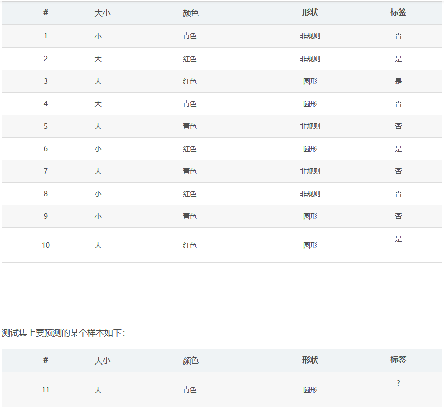  

**此处标签里的“否”对应的就是下方的“一般”。**

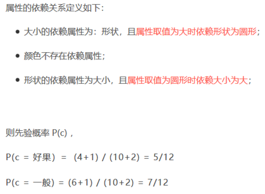

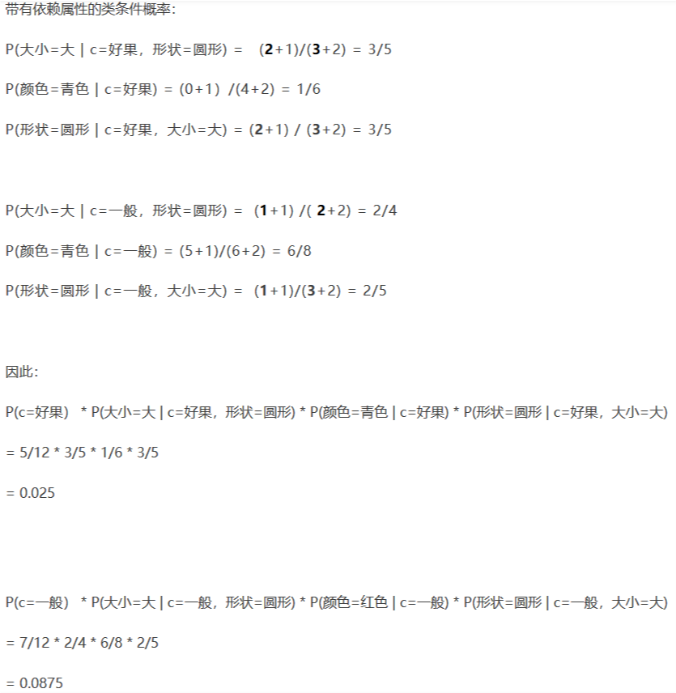

## 吉布斯采样

[博客](https://blog.csdn.net/pipisorry/article/details/51373090)

### 为什么要用吉布斯采样

#### 什么是sampling?

sampling就是以一定的概率分布，看发生什么事件。举一个例子。甲只能E：吃饭、学习、打球，时间T：上午、下午、晚上，天气W：晴朗、刮风、下雨。现在要一个sample，这个sample可以是：打球+下午+晴朗。

#### 吉布斯采样的通俗解释？

问题是我们不知道p(E,T,W)，或者说，不知道三件事的联合分布joint distribution。当然，如果知道的话，就没有必要用gibbs sampling了。但是，我们知道三件事的conditional distribution。也就是说，p(E|T,W),p(T|E,W),p(W|E,T)。现在要做的就是通过这三个已知的条件分布，再用gibbs sampling的方法，得到联合分布。
 具体方法。首先随便初始化一个组合,i.e.  学习+晚上+刮风，然后依条件概率改变其中的一个变量。具体说，假设我们知道晚上+刮风，我们给E生成一个变量，比如，学习-》吃饭。我们再依条件概率改下一个变量，根据学习+刮风，把晚上变成上午。类似地，把刮风变成刮风（当然可以变成相同的变量）。这样学习+晚上+刮风-》吃饭+上午+刮风。同样的方法，得到一个序列，每个单元包含三个变量，也就是一个马尔可夫链。然后跳过初始的一定数量的单元（比如100个），然后隔一定的数量取一个单元（比如隔20个取1个）。这样sample到的单元，是逼近联合分布的。

## 贝叶斯网

[博客1](https://blog.csdn.net/weixin_41575207/article/details/82077800)：主要讲得是贝叶斯网的结构

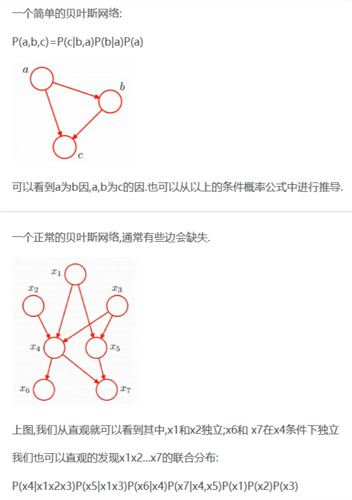

## EM算法

[博客](https://zhuanlan.zhihu.com/p/36331115)

E步：用参数推测（隐变量）值

M步：计算参数

EM的意思是“**Expectation Maximization**”，具体方法为：

- 先设定男生和女生的身高分布参数(初始值)，例如男生的身高分布为 ![[公式]](https://www.zhihu.com/equation?tex=N%28%5Cmu_1+%3D+172%2C+%5Csigma%5E2_1%3D5%5E2%29) ， 女生的身高分布为 ![[公式]](https://www.zhihu.com/equation?tex=N%28%5Cmu_2+%3D+162%2C+%5Csigma%5E2_2%3D5%5E2%29) ，当然了，刚开始肯定没那么准；
- 然后计算出每个人更可能属于第一个还是第二个正态分布中的（例如，这个人的身高是180，那很明显，他极大可能属于男生），这个是属于Expectation 一步；
- 我们已经大概地按上面的方法将这 200 个人分为男生和女生两部分，我们就可以根据之前说的极大似然估计分别对男生和女生的身高分布参数进行估计（这不变成了**极大**似然估计了吗？**极大即为Maximization**）这步称为 Maximization；
- 然后，当我们更新这两个分布的时候，每一个学生属于女生还是男生的概率又变了，那么我们就再需要调整E步；
- ……如此往复，直到参数基本不再发生变化或满足结束条件为止。

## AdaBoost

[博客](https://zhuanlan.zhihu.com/p/27126737)

工作原理：通过每次降低个体学习器的分类误差，加大效果好的个体学习器的重要性，得到最终的集成学习器。

## Boosting与Bagging

从偏差-方差分解的角度看，Boosting主要关注降低偏差，因此Boosting能基于泛化性能相当弱的学习器构建出很强的集成。

从偏差-方差的角度看，Bagging主要关注降低方差，因此它在不剪枝决策树、神经网络等易受样本扰动的学习器上效用更为明显。

## 高斯混合聚类

[博客1](https://blog.csdn.net/lotusng/article/details/79990724)

[多元高斯分布](https://www.cnblogs.com/sptv-88/p/11697337.html)

**==公式(9.29)的说明：==**

- 首先，当*i*=1，比如这里是指坏瓜类，那么这时坏瓜的高斯曲线已知已确定了（即$μ_1$、$Σ_1$已确定）。根据这个确定高斯曲线可以得到样本瓜*x*在坏瓜类中存在的概率*p*(*x*∣$μ_1$,$Σ_1$)。

- 然后， *p*(*x*∣$μ_1$,$Σ_1$) 与 $α_i$相乘的结果就是从坏瓜类中抽中样本瓜*x*的概率。（乘完的结果应该是相对于全部样本的概率）

- 最后，分别计算*i*=1（从坏瓜类中抽）、*i*=2（从一般瓜类中抽）和*i*=3（从好瓜类中抽）的情况下抽到样本瓜*x*的概率，将这三种情况下的概率相加，得到的$P_m(x)$即是在自然界中抽一个瓜正好抽中样本瓜*x*的概率。

由于每类瓜分别拥有3个参数$α$、$μ$、$Σ$，因为类*i*=3，即这个例子里一共有9个参数。

**总结高斯混合聚类的步骤**：首先假设样本集具有一些规律，包括可以以*α*参数作为比例分为*k*类且每类内符合高斯分布。然后根据贝叶斯原理利用极大似然法同时求出决定分类比例的*α*和决定类内高斯分布的*μ*、Σ。最后将样本根据*α*、*μ*、Σ再次通过贝叶斯原理求出样本该分在哪个簇。

整个步骤下来，这种做法其实就是一种**原型聚类**：通过找到可以刻画样本的原型（*α*、*μ*、Σ参数），迭代得到*α*、*μ*、Σ参数的最优解。

**公式9.33推导：**

$$ \sum_{j=1}^{m} \frac{\alpha_{i} \cdot p\left(\boldsymbol{x}_{j} | \boldsymbol{\mu}_{i}, \boldsymbol{\Sigma}_{i}\right)}{\sum_{l=1}^{k} \alpha_{l} \cdot p\left(\boldsymbol{x}_{j} | \boldsymbol{\mu}_{l}, \boldsymbol{\Sigma}_{l}\right)}\left(\boldsymbol{x}_{j}-\boldsymbol{\mu}_{i}\right)=0 $$ [推导]：根据公式(9.28)可知： $$ p\left(\boldsymbol{x}_{j} | \boldsymbol{\mu}_{i}, \boldsymbol{\Sigma}_{i}\right)=\frac{1}{(2 \pi)^{\frac{n}{2}}\left|\boldsymbol{\Sigma}_{i}\right|^{\frac{1}{2}}} \exp \left(-\frac{1}{2}\left(\boldsymbol{x}_{j}-\boldsymbol{\mu}_{i}\right)^{T} \boldsymbol{\Sigma}_{i}^{-1}\left(\boldsymbol{x}_{j}-\boldsymbol{\mu}_{i}\right)\right) $$ 又根据公式(9.32)，由 $$ \frac{\partial L L(D)}{\partial \boldsymbol{\mu}_{i}}=\frac{\partial L L(D)}{\partial p\left(\boldsymbol{x}_{j} | \boldsymbol{\mu}_{i}, \boldsymbol{\Sigma}_{i}\right)} \cdot \frac{\partial p\left(\boldsymbol{x}_{j} | \boldsymbol{\mu}_{i}, \boldsymbol{\Sigma}_{i}\right)}{\partial \boldsymbol{\mu}_{i}}=0 $$ 其中： $$ \begin{aligned} \frac{\partial L L(D)}{\partial p\left(\boldsymbol{x}_{j} | \boldsymbol{\mu}_{i}, \mathbf{\Sigma}_{i}\right)} &=\frac{\partial \sum_{j=1}^{m} \ln \left(\sum_{l=1}^{k} \alpha_{l} \cdot p\left(\boldsymbol{x}_{j} | \boldsymbol{\mu}_{l}, \boldsymbol{\Sigma}_{l}\right)\right)}{\partial p\left(\boldsymbol{x}_{j} | \boldsymbol{\mu}_{i}, \boldsymbol{\Sigma}_{i}\right)} \ &=\sum_{j=1}^{m} \frac{\partial \ln \left(\sum_{l=1}^{k} \alpha_{l} \cdot p\left(\boldsymbol{x}_{j} | \boldsymbol{\mu}_{l}, \boldsymbol{\Sigma}_{l}\right)\right)}{\partial p\left(\boldsymbol{x}_{j} | \boldsymbol{\mu}_{i}, \boldsymbol{\Sigma}_{i}\right)} \ &=\sum_{j=1}^{m} \frac{\alpha_{i}}{\sum_{l=1}^{k} \alpha_{l} \cdot p\left(\boldsymbol{x}_{j} | \boldsymbol{\mu}_{l}, \boldsymbol{\Sigma}_{l}\right)} \end{aligned} $$

$$ \begin{aligned} \frac{\partial p\left(\boldsymbol{x}_{j} | \boldsymbol{\mu}_{i}, \boldsymbol{\Sigma}_{i}\right)}{\partial \boldsymbol{\mu}_{i}} &=\frac{\partial \frac{1}{(2  \pi)^{\frac{n}{2}}\left|\Sigma_{i}\right|^{\frac{1}{2}}}  \exp\left({-\frac{1}{2}\left(\boldsymbol{x}_{j}-\boldsymbol{\mu}_{i}\right)^{\top}\boldsymbol{\Sigma}_{i}^{-1}\left(\boldsymbol{x}_{j}-\boldsymbol{\mu}_{i}\right)}\right)}{\partial \boldsymbol{\mu}_{i}} \ &=\frac{1}{(2 \pi)^{\frac{n}{2}}\left|\boldsymbol{\Sigma}_{i}\right|^{\frac{1}{2}}} \cdot \frac{\partial \exp\left({-\frac{1}{2}\left(\boldsymbol{x}_{j}-\boldsymbol{\mu}_{i}\right)^{\top} \boldsymbol{\Sigma}_{i}^{-1}\left(\boldsymbol{x}_{j}-\boldsymbol{\mu}_{i}\right)}\right)}{\partial \boldsymbol{\mu}_{i}}\ &=\frac{1}{(2 \pi)^{\frac{n}{2}}\left|\boldsymbol{\Sigma}_{i}\right|^{\frac{1}{2}}}\cdot \exp\left({-\frac{1}{2}\left(\boldsymbol{x}_{j}-\boldsymbol{\mu}_{i}\right)^{\top} \boldsymbol{\Sigma}_{i}^{-1}\left(\boldsymbol{x}_{j}-\boldsymbol{\mu}_{i}\right)}\right) \cdot-\frac{1}{2} \frac{\partial\left(\boldsymbol{x}_{j}-\boldsymbol{\mu}_{i}\right)^{\top} \boldsymbol{\Sigma}_{i}^{-1}\left(\boldsymbol{x}_{j}-\boldsymbol{\mu}_{i}\right)}{\partial \boldsymbol{\mu}_{i}}\ &=\frac{1}{(2 \pi)^{\frac{n}{2}}\left|\boldsymbol{\Sigma}_{i}\right|^{\frac{1}{2}}}\cdot \exp\left({-\frac{1}{2}\left(\boldsymbol{x}_{j}-\boldsymbol{\mu}_{i}\right)^{\top} \boldsymbol{\Sigma}_{i}^{-1}\left(\boldsymbol{x}_{j}-\boldsymbol{\mu}_{i}\right)}\right) \cdot\boldsymbol{\Sigma}_{i}^{-1}\left(\boldsymbol{x}_{j}-\boldsymbol{\mu}_{i}\right)\ &=p\left(\boldsymbol{x}_{j} | \boldsymbol{\mu}_{i}, \boldsymbol{\Sigma}_{i}\right) \cdot \boldsymbol{\Sigma}_{i}^{-1}\left(\boldsymbol{x}_{j}-\boldsymbol{\mu}_{i}\right) \end{aligned} $$

其中，由矩阵求导的法则$\frac{\partial \mathbf{a}^{T} \mathbf{X} \mathbf{a}}{\partial \mathbf{a}}=2\mathbf{X} \mathbf{a}$可得： $$ \begin{aligned} -\frac{1}{2} \frac{\partial\left(\boldsymbol{x}_{j}-\boldsymbol{\mu}_{i}\right)^{\top} \boldsymbol{\Sigma}_{i}^{-1}\left(\boldsymbol{x}_{j}-\boldsymbol{\mu}_{i}\right)}{\partial \boldsymbol{\mu}_{i}} &=-\frac{1}{2} \cdot 2 \boldsymbol{\Sigma}_{i}^{-1}\left(\boldsymbol{\mu}_{i}-\boldsymbol{x}_{j}\right) \ &=\boldsymbol{\Sigma}_{i}^{-1}\left(\boldsymbol{x}_{j}-\boldsymbol{\mu}_{i}\right) \end{aligned} $$

因此有： $$ \frac{\partial L L(D)}{\partial \boldsymbol{\mu}_{i}}=\sum_{j=1}^{m} \frac{\alpha_{i}}{\sum_{l=1}^{k} \alpha_{l} \cdot p\left(\boldsymbol{x}_{j} | \boldsymbol{\mu}_{l}, \mathbf{\Sigma}_{l}\right)} \cdot p\left(\boldsymbol{x}_{j} | \boldsymbol{\mu}_{i}, \boldsymbol{\Sigma}_{i}\right) \cdot \boldsymbol{\Sigma}_{i}^{-1}\left(\boldsymbol{x}_{j}-\boldsymbol{\mu}_{i}\right)=0 $$

## 主成分分析

这部分思想和计算方法看了博客啥的大概算是懂了，但是推导（尤其是10.14式子上面那个）没想通，暂时也没找到很好的推导内容。南瓜书里面推导也有，但反正没吃透，这部分等到后面还是要再回过头来看，最好还是要彻底理解原理咋来的（虽然看了也很快就忘）。